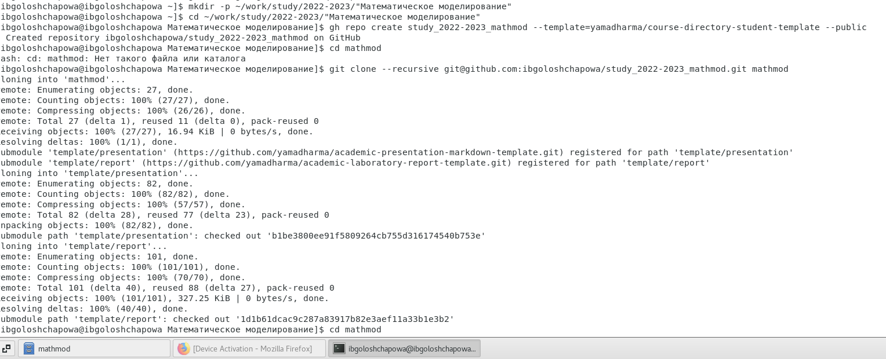

---
# Front matter
lang: ru-RU
title: "Отчёт по лабораторной работе №1"
subtitle: " Работа с git и Markdown"
author: "Голощапова Ирина Борисовна"

# Formatting
toc-title: "Содержание"
toc: true # Table of contents
toc_depth: 2
lof: true # List of figures
lot: true # List of tables
fontsize: 12pt
linestretch: 1.5
papersize: a4paper
documentclass: scrreprt
polyglossia-lang: russian
polyglossia-otherlangs: english
mainfont: PT Serif
romanfont: PT Serif
sansfont: PT Sans
monofont: PT Mono
mainfontoptions: Ligatures=TeX
romanfontoptions: Ligatures=TeX
sansfontoptions: Ligatures=TeX,Scale=MatchLowercase
monofontoptions: Scale=MatchLowercase
indent: true
pdf-engine: lualatex
header-includes:
  - \linepenalty=10 # the penalty added to the badness of each line within a paragraph (no associated penalty node) Increasing the value makes tex try to have fewer lines in the paragraph.
  - \interlinepenalty=0 # value of the penalty (node) added after each line of a paragraph.
  - \hyphenpenalty=50 # the penalty for line breaking at an automatically inserted hyphen
  - \exhyphenpenalty=50 # the penalty for line breaking at an explicit hyphen
  - \binoppenalty=700 # the penalty for breaking a line at a binary operator
  - \relpenalty=500 # the penalty for breaking a line at a relation
  - \clubpenalty=150 # extra penalty for breaking after first line of a paragraph
  - \widowpenalty=150 # extra penalty for breaking before last line of a paragraph
  - \displaywidowpenalty=50 # extra penalty for breaking before last line before a display math
  - \brokenpenalty=100 # extra penalty for page breaking after a hyphenated line
  - \predisplaypenalty=10000 # penalty for breaking before a display
  - \postdisplaypenalty=0 # penalty for breaking after a display
  - \floatingpenalty = 20000 # penalty for splitting an insertion (can only be split footnote in standard LaTeX)
  - \raggedbottom # or \flushbottom
  - \usepackage{float} # keep figures where there are in the text
  - \floatplacement{figure}{H} # keep figures where there are in the text
---

# Цель работы

Научиться оформлять отчёты с помощью легковесного языка разметки Markdown

# Библиография
[Git - система контроля версий](https://github.com/)

[Википедия - Язык разметки Markdown](https://ru.wikipedia.org/wiki/Markdown)

[Установка gh на LINUX](https://github.com/cli/cli/blob/trunk/docs/install_linux.md)

# Выполнение лабораторной работы

1. Авторизация пользователя на github и настройка параметров для корректного отображения:
– mkdir -p ~/work/study/2022-2023/"Математическое моделирование"
– cd ~/work/study/2022-2023/"Математическое моделирование"
– gh repo create study_2022-2023_mathmod --template=yamadharma/course-directory-student-template --public
– git clone --recursive git@github.com:<owner>/study_2022-2023_mathmod.git mathmod

*Рис.1 "Авторизация пользователя на github"*

*Рис.2 "Настройка необходимых параметров"*

2. Создание каталогов согласно шаблону с помощью командной строки

*Рис.3 "Создание каталогов"*

*Рис.4 "Создание репозитория. Публикация на github.com"*

3. Посмотрела доступные цели с помощью команды "make help". Открыла список доступных курсов "make list"

*Рис.6 "make help, make list"*

4. Отправила созданные файлы на сервер

*Рис.6 "Отправка на сервер"*

*Рис.6 "Отправка на сервер_2"*

4. В результате получила свой репозиторий на github.com

*Рис.6 "Полученный репозиторий на github.com"*

5. Далее с помощью языка разметки Markdown оформила отчет и с помощью Makefile переконвертировала в pdf и docx форматы

# Выводы

В ходе лабораторной работы я вспомнила, как создавать репозиторий с помощью командной строки, работать с Github.com и оформлять отчёты с помощью легковесного языка разметки Markdown

