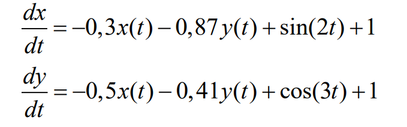
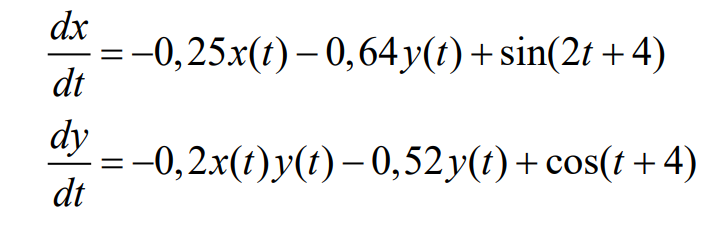
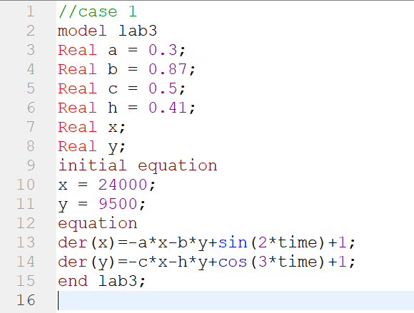
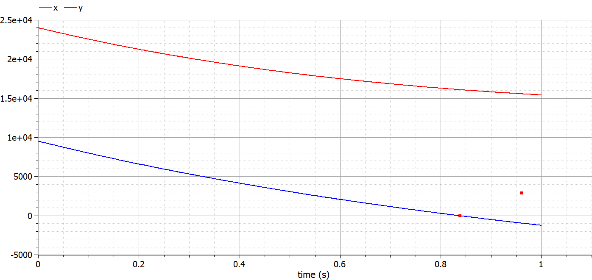
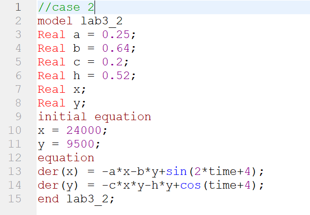
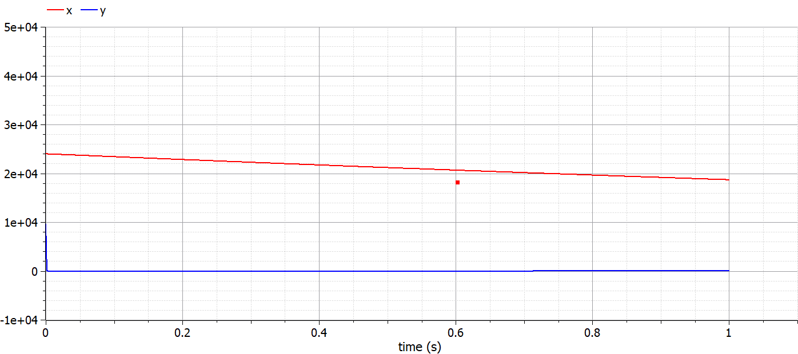
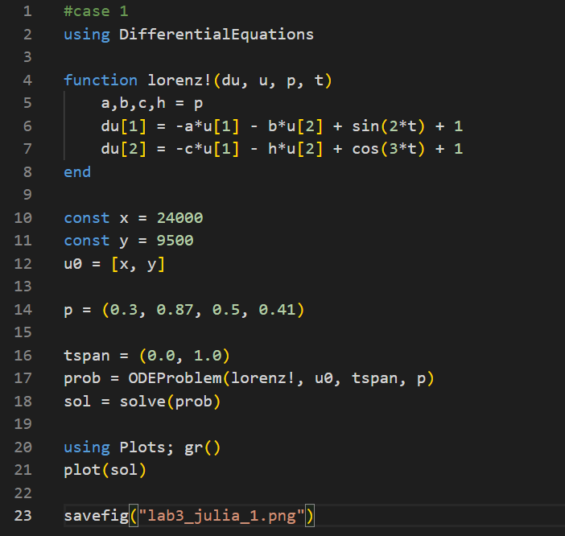
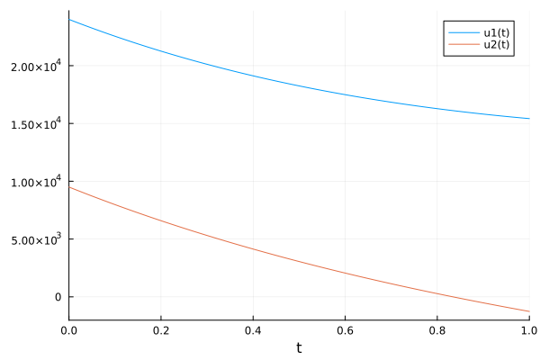
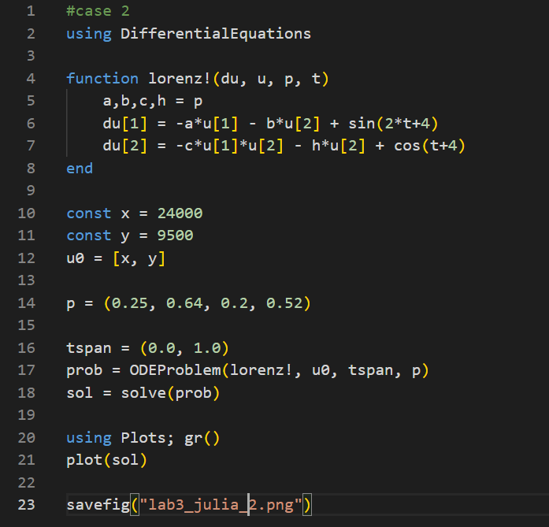
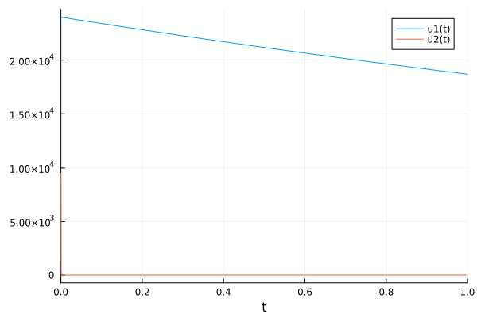

---
## Front matter
lang: ru-RU
title: Лабораторная работа №3
subtitle: Модель боевых действий
author:
  - Голощапова Ирина Борисовна
institute:
  - Российский университет дружбы народов, Москва, Россия
date: 25 февраля 2023

## i18n babel
babel-lang: russian
babel-otherlangs: english

## Fonts
mainfont: PT Serif
romanfont: PT Serif
sansfont: PT Sans
monofont: PT Mono
mainfontoptions: Ligatures=TeX
romanfontoptions: Ligatures=TeX
sansfontoptions: Ligatures=TeX,Scale=MatchLowercase
monofontoptions: Scale=MatchLowercase,Scale=0.9

## Formatting pdf
toc: false
toc-title: Содержание
slide_level: 2
aspectratio: 169
section-titles: true
theme: metropolis
header-includes:
 - \metroset{progressbar=frametitle,sectionpage=progressbar,numbering=fraction}
 - '\makeatletter'
 - '\beamer@ignorenonframefalse'
 - '\makeatother'
---

# Информация

## Докладчик

:::::::::::::: {.columns align=center}
::: {.column width="70%"}

  * Голощапова Ирина Борисовна
  * студентка уч. группы НФИбд-01-20
  * Российский университет дружбы народов
  * [1032201666@pfur.ru](mailto:1032201666@pfur.ru)
  * <https://github.com/ibgoloshchapowa>

:::
::: {.column width="30%"}

:::
::::::::::::::

# Вводная часть

## Актуальность

Моделирование боевых и военных действий является важнейшей научной и практической задачей, направленной на предоставление командованию количественных оснований для принятия решений. Поэтому важно разобраться в алгоритме построения математических моделей и понять принцип их работы.

## Объект и предмет исследования

- Модель боевых действий
- Язык программирования Julia
- OpenModelica

## Цели и задачи

- Разобраться в алгоритме построения математической модели.
- Рассмотреть некоторые простейшие модели боевых действий – модели Ланчестера.
- Построить графики изменения численности войск армии Х и армии У для следующих случаев:
    1. Модель боевых действий между регулярными войсками
    2. Модель ведение боевых действий с участием регулярных войск и партизанских отрядов 
- Определить по графику, какая из армий одержит победу в ходе военных действий

## Условие задачи. Вариант 7

Между страной Х и страной У идет война. Численность состава войск исчисляется от начала войны, и являются временными функциями 
x(t)и y(t). В начальный момент времени страна Х имеет армию численностью 24 000 человек, а в распоряжении страны У армия численностью в 9 500 человек. Для упрощения 
модели считаем, что коэффициенты 
a, b, c, h постоянны. Также считаем P(t) и Q(t) непрерывные функции.

Постройте графики изменения численности войск армии Х и армии У для следующих случаев:

1. Модель боевых действий между регулярными войсками 

{width=40%}

## Условие задачи. Вариант 7

2. Модель ведение боевых действий с участием регулярных войск и партизанских отрядов 

{width=40%}

# Процесс выполнения работы

1. Листинг программы в OpenModelic для случая №1 

{width=40%}

## Процесс выполнения работы

2. Модель для случая №1 в OpenModelica

{width=70%}
В результате программы победу одерживает армия X. 

## Процесс выполнения работы
3. Листинг программы в OpenModelic для случая №2 

{width=40%}

## Процесс выполнения работы
4. Модель для случая №2 в OpenModelica

{width=70%}
В результате программы победу одерживает армия X. 

## Процесс выполнения работы
5. Листинг программы в Julia для случая №1

{width=40%}

## Процесс выполнения работы
6. Модель для случая №1 в Julia

{width=40%}

## Процесс выполнения работы
7. Листинг программы в Julia для случая №2

{width=40%}

## Процесс выполнения работы
8. Модель для случая №2 в Julia

{width=40%}

# Результаты

- Разобралась в алгоритме построения математической модели.
- Рассмотрела модели Ланчестера.
- Построила графики изменения численности войск армии Х и армии У для следующих случаев:
    1. Модель боевых действий между регулярными войсками
    2. Модель ведение боевых действий с участием регулярных войск и партизанских отрядов 
- Определила по графику, какая из армий одержит победу в ходе военных действий

## Вывод

В ходе лабораторной работы нам удалось построить модель боевых действий на двух языках: OpenModelica и Julia, а также с помощью построенных графиков определить, какая из двух армий одержит победу.
