---
# Front matter
lang: ru-RU
title: "Отчёт по лабораторной работе №3"
subtitle: "Модель боевых действий"
author: "Голощапова Ирина Борисовна"

# Formatting
toc-title: "Содержание"
toc: true # Table of contents
toc_depth: 2
lof: true # List of figures
lot: true # List of tables
fontsize: 12pt
linestretch: 1.5
papersize: a4paper
documentclass: scrreprt
polyglossia-lang: russian
polyglossia-otherlangs: english
mainfont: PT Serif
romanfont: PT Serif
sansfont: PT Sans
monofont: PT Mono
mainfontoptions: Ligatures=TeX
romanfontoptions: Ligatures=TeX
sansfontoptions: Ligatures=TeX,Scale=MatchLowercase
monofontoptions: Scale=MatchLowercase
indent: true
pdf-engine: lualatex
header-includes:
  - \linepenalty=10 # the penalty added to the badness of each line within a paragraph (no associated penalty node) Increasing the value makes tex try to have fewer lines in the paragraph.
  - \interlinepenalty=0 # value of the penalty (node) added after each line of a paragraph.
  - \hyphenpenalty=50 # the penalty for line breaking at an automatically inserted hyphen
  - \exhyphenpenalty=50 # the penalty for line breaking at an explicit hyphen
  - \binoppenalty=700 # the penalty for breaking a line at a binary operator
  - \relpenalty=500 # the penalty for breaking a line at a relation
  - \clubpenalty=150 # extra penalty for breaking after first line of a paragraph
  - \widowpenalty=150 # extra penalty for breaking before last line of a paragraph
  - \displaywidowpenalty=50 # extra penalty for breaking before last line before a display math
  - \brokenpenalty=100 # extra penalty for page breaking after a hyphenated line
  - \predisplaypenalty=10000 # penalty for breaking before a display
  - \postdisplaypenalty=0 # penalty for breaking after a display
  - \floatingpenalty = 20000 # penalty for splitting an insertion (can only be split footnote in standard LaTeX)
  - \raggedbottom # or \flushbottom
  - \usepackage{float} # keep figures where there are in the text
  - \floatplacement{figure}{H} # keep figures where there are in the text
---

# Цель работы

Разобраться в алгоритме построения математической модели.
Рассмотреть некоторые простейшие модели боевых действий – модели Ланчестера.

# Библиография
1. [Git - система контроля версий](https://github.com/)

2. [Дифференциальные уравнения](https://ru.wikipedia.org/wiki/Дифференциальное_уравнение)

3. [Язык программирования - Julia](https://julialang.org/)

4. [Решение ДУ на языке программирование Julia](https://nextjournal.com/sosiris-de/ode-diffeq)

5. [Установка и настройка OpenModelica](https://openmodelica.org/download/download-linux/)

# Задачи лабораторной работы

1. Изучить условие задачи о моделе боевых действий
2. Провести рассуждения и вывести дифференциальные уравнения 
3. Построить математическую модель
4. Определить по графику, какая армия одержит победу

# Теоретическая справка
Рассмотрим некоторые простейшие модели боевых действий – модели Ланчестера. В противоборстве могут принимать участие как регулярные войска, так и партизанские отряды. В общем случае главной характеристикой соперников являются численности сторон. Если в какой-то момент времени одна из 
численностей обращается в нуль, то данная сторона считается проигравшей (при условии, что численность другой стороны в данный момент положительна).

В данной лабораторной работе будет представлено два случая:

1. Боевые действия между регулярными войсками
2. Боевые действия с участием регулярных войск и партизанских 
отрядов

## Первый случай
В первом случае численность регулярных войск определяется тремя факторами:
 - скорость уменьшения численности войск из-за причин, не связанных с боевыми действиями (болезни, травмы, дезертирство);
 - скорость потерь, обусловленных боевыми действиями 
противоборствующих сторон (что связанно с качеством стратегии, 
уровнем вооружения, профессионализмом солдат и т.п.);
 - скорость поступления подкрепления (задаётся некоторой функцией от времени).
 
В этом случае модель боевых действий между регулярными войсками описывается следующим образом (рис. @fig:01):

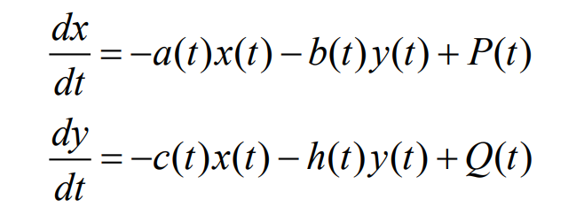{#fig:01 width=86%}

Потери, не связанные с боевыми действиями, описывают члены -a(t)x(t), члены -b(t)y(t) и -c(t)x(t) отражают потери на поле боя. 

Коэффициенты b(t) и c(t) указывают на эффективность боевых действий со стороны у и х соответственно, a(t), h(t) - величины, характеризующие степень влияния различных факторов на потери. 

Функции P(t), Q(t) учитывают возможность подхода подкрепления к войскам Х и У в течение одного дня.

## Второй случай

Во втором случае в борьбу добавляются партизанские отряды. Нерегулярные войска в отличии от постоянной армии менее уязвимы, так как действуют скрытно, в этом случае сопернику приходится действовать неизбирательно, по площадям, 
занимаемым партизанами. Поэтому считается, что тем потерь партизан, проводящих свои операции в разных местах на некоторой известной территории, 
пропорционален не только численности армейских соединений, но и численности самих партизан. 

В результате модель принимает вид (рис. @fig:02):

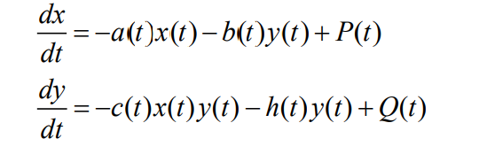{#fig:02 width=86%}

# Условие задачи (вариант №7)
Между страной Х и страной У идет война. Численность состава войск исчисляется от начала войны, и являются временными функциями 
x(t)и y(t). В начальный момент времени страна Х имеет армию численностью 24 000 человек, а в распоряжении страны У армия численностью в 9 500 человек. Для упрощения 
модели считаем, что коэффициенты 
a, b, c, h постоянны. Также считаем P(t) и Q(t) непрерывные функции.

Постройте графики изменения численности войск армии Х и армии У для следующих случаев:

1. Модель боевых действий между регулярными войсками (рис. @fig:03)

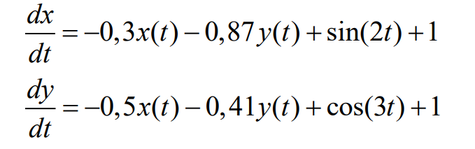{#fig:03 width=86%}

2. Модель ведение боевых действий с участием регулярных войск и партизанских отрядов (рис. @fig:04)

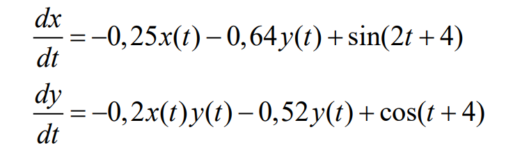{#fig:04 width=86%}

# Выполнение лабораторной работы

## Реализация в OpenModelica. Случай №1
Для начала реализуем данную задачу в OpenModelica.

Листинг программы для первого случая (рис. @fig:5):

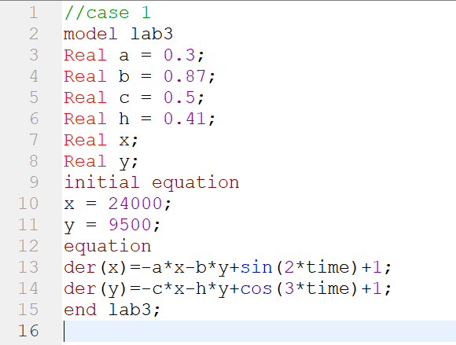{#fig:5 width=86%}

В результате получим следующую модель (рис. @fig:6):

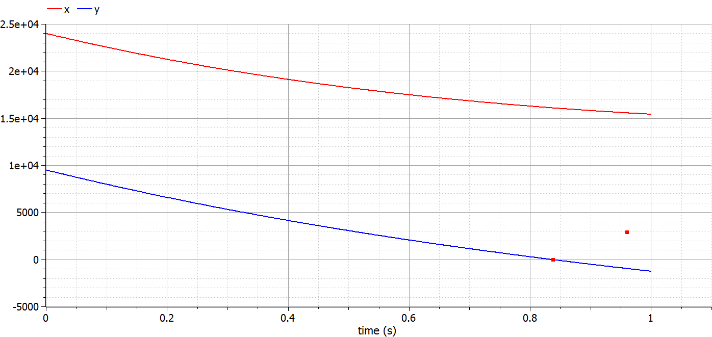{#fig:6 width=86%}

Таким образом, график нам показывает, что одержит победу армия X.

## Реализация в OpenModelica. Случай №2

Листинг программы для второго случая (рис. @fig:7):

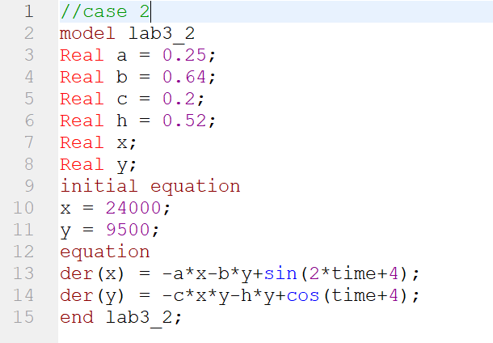{#fig:7 width=86%}

В результате получим следующую модель (рис. @fig:8):

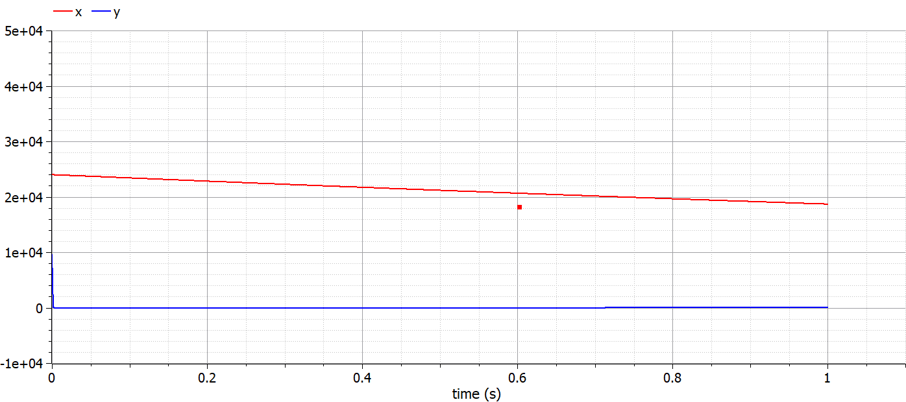{#fig:8 width=86%}

На графике видно, что одержит победу армия X.

## Реализация на Julia. Случай №1

Листинг программы для первого случая (рис. @fig:9):

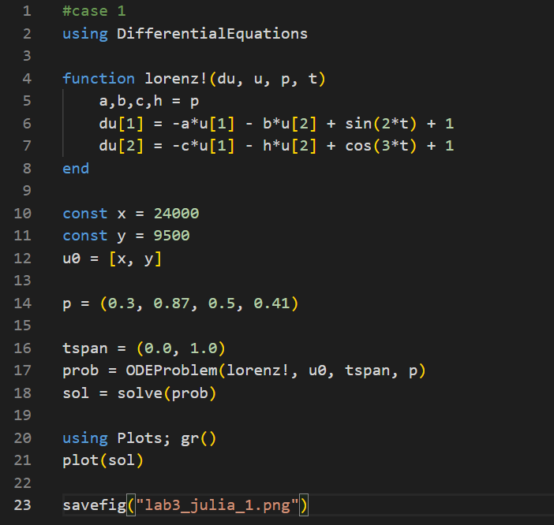{#fig:9 width=86%}

В результате получим следующую модель (рис. @fig:10):

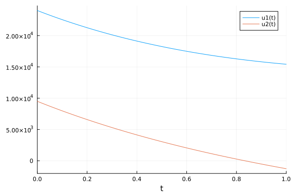{#fig:10 width=86%}

## Реализация на Julia. Случай №2

Листинг программы для второго случая (рис. @fig:11):

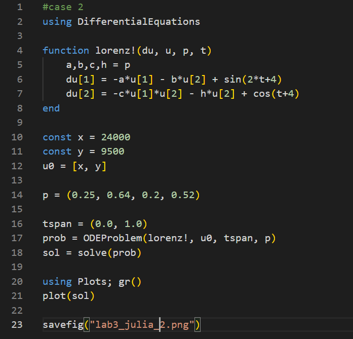{#fig:11 width=86%}

В результате получим следующую модель (рис. @fig:11):

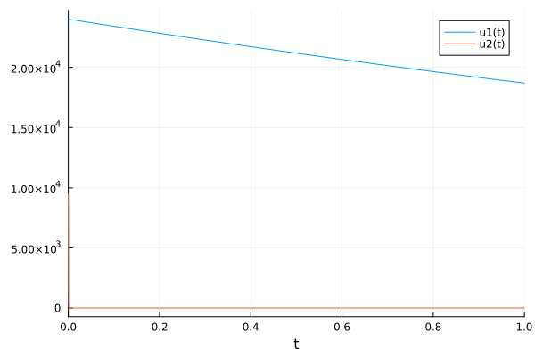{#fig:12 width=86%}

# Выводы

В ходе лабораторной работы нам удалось построить модель боевых действий на двух языках программирования: OpenModelica и Julia, а также с помощью построенных графиков определить, какая из двух армий одержит победу.
