---
## Front matter
lang: ru-RU
title: Лабораторная работа №4
subtitle: Модель гармонических колебаний
author:
  - Голощапова Ирина Борисовна
institute:
  - Российский университет дружбы народов, Москва, Россия
date: 25 февраля 2023

## i18n babel
babel-lang: russian
babel-otherlangs: english

## Fonts
mainfont: PT Serif
romanfont: PT Serif
sansfont: PT Sans
monofont: PT Mono
mainfontoptions: Ligatures=TeX
romanfontoptions: Ligatures=TeX
sansfontoptions: Ligatures=TeX,Scale=MatchLowercase
monofontoptions: Scale=MatchLowercase,Scale=0.9

## Formatting pdf
toc: false
toc-title: Содержание
slide_level: 2
aspectratio: 169
section-titles: true
theme: metropolis
header-includes:
 - \metroset{progressbar=frametitle,sectionpage=progressbar,numbering=fraction}
 - '\makeatletter'
 - '\beamer@ignorenonframefalse'
 - '\makeatother'
---

# Информация

## Докладчик

:::::::::::::: {.columns align=center}
::: {.column width="70%"}

  * Голощапова Ирина Борисовна
  * студентка уч. группы НФИбд-01-20
  * Российский университет дружбы народов
  * [1032201666@pfur.ru](mailto:1032201666@pfur.ru)
  * <https://github.com/ibgoloshchapowa>

:::
::: {.column width="30%"}

:::
::::::::::::::

# Вводная часть

## Актуальность

Модель гармонического осциллятора очень важна в физике, потому что любая масса, подверженная силе в устойчивом равновесии, действует как гармонический осциллятор для малых колебаний. Генераторы гармонических колебаний широко распространены в природе и используются во многих искусственных устройствах, таких как часы и радиосхемы. Именно поэтому важно изучить данную модуль, научиться строить фазовые портреты и находить решение уравнения.

## Объект и предмет исследования

- Модель гармонических колебаний
- Язык программирования Julia
- OpenModelica

## Цели и задачи

1. Разобраться в понятии гармонического осциллятора
2. Ознакомиться с уравнением свободных колебаний гармонического осциллятора
3. Построить фазовый портрет гармонического осциллятора и решение уравнения гармонического осциллятора для следующих случаев:
    - Колебания гармонического осциллятора без затуханий и без действий внешней силы 
    - Колебания гармонического осциллятора c затуханием и без действий внешней силы
    - Колебания гармонического осциллятора c затуханием и под действием внешней силы

## Условие задачи. Вариант 7

Постройте фазовый портрет гармонического осциллятора и решение уравнения гармонического осциллятора для следующих случаев

1. Колебания гармонического осциллятора без затуханий и без действий внешней силы

    x'' + 7x = 0
2. Колебания гармонического осциллятора c затуханием и без действий внешней силы
    
    x'' + 2x' + 6x = 0
3. Колебания гармонического осциллятора c затуханием и под действием внешней силы
    
    x'' + 5x + x = cos(3t)

# Выполнение работы
# Случай 1: Колебания гармонического осциллятора без затуханий и без действий внешней силы

## Колебания гармонического осциллятора без затуханий и без действий внешней силы
1. Листинг программы в OpenModelica для случая №1 

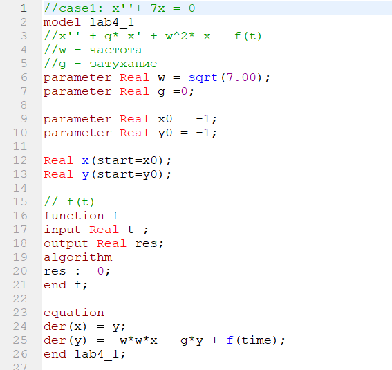{width=40%}

## Колебания гармонического осциллятора без затуханий и без действий внешней силы

2. Решение для случая №1 в OpenModelica

{width=70%}

## Колебания гармонического осциллятора без затуханий и без действий внешней силы

3. Фазовый портрет для случая №1 в OpenModelica

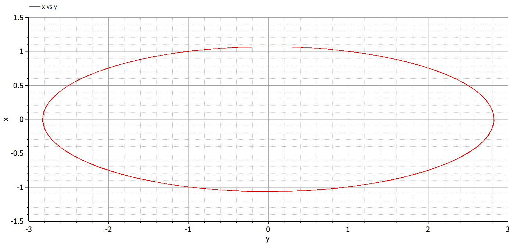{width=70%}

## Колебания гармонического осциллятора без затуханий и без действий внешней силы
4. Листинг программы на Julia для случая №1 

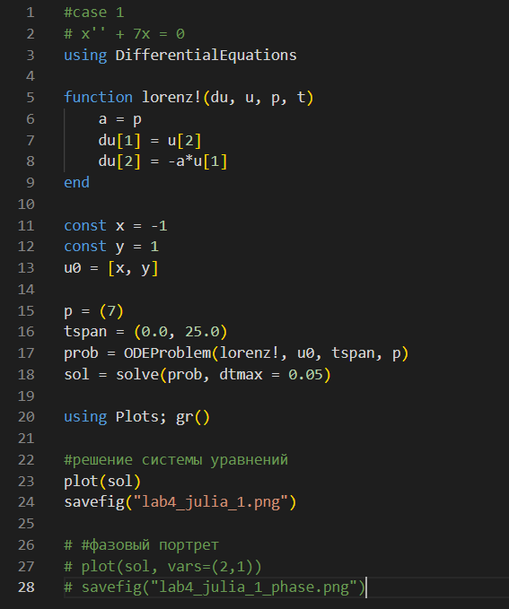{width=30%}

## Колебания гармонического осциллятора без затуханий и без действий внешней силы

5. Решение для случая №1 на Julia

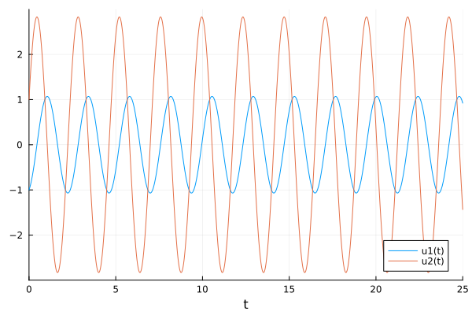{width=50%}

## Колебания гармонического осциллятора без затуханий и без действий внешней силы

6. Фазовый портрет для случая №1 на Julia

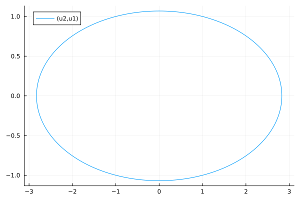{width=50%}

# Случай 2: Колебания гармонического осциллятора c затуханием и без действий внешней силы

## Колебания гармонического осциллятора c затуханием и без действий внешней силы

7. Листинг программы в OpenModelica для случая №2 

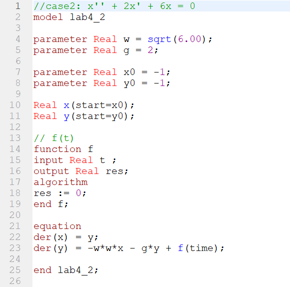{width=30%}

## Колебания гармонического осциллятора c затуханием и без действий внешней силы

8. Решение для случая №2 в OpenModelica

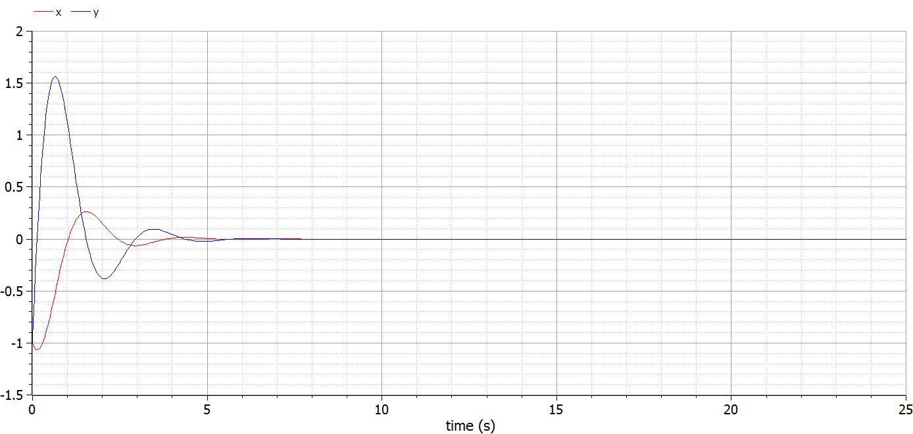{width=70%}

## Колебания гармонического осциллятора c затуханием и без действий внешней силы

9. Фазовый портрет для случая №2 в OpenModelica

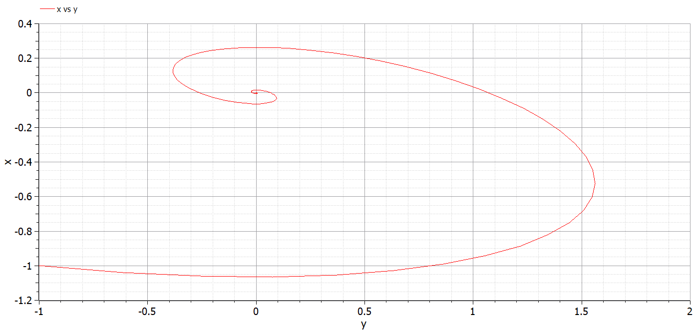{width=70%}

## Колебания гармонического осциллятора c затуханием и без действий внешней силы

10. Листинг программы на Julia для случая №2 

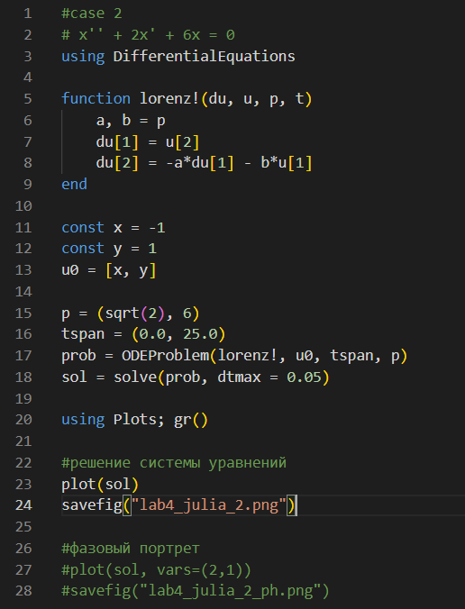{width=30%}

## Колебания гармонического осциллятора c затуханием и без действий внешней силы

11. Решение для случая №2 в Julia

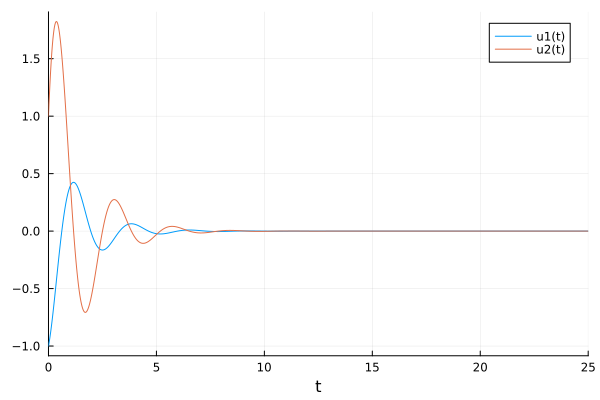{width=50%}

## Колебания гармонического осциллятора c затуханием и без действий внешней силы

12. Фазовый портрет для случая №2 в Julia

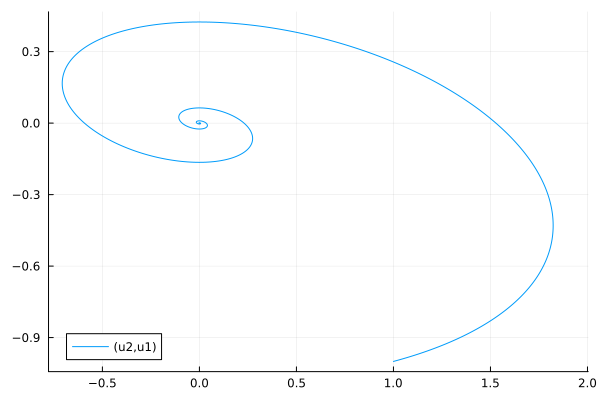{width=50%}

# Случай 3: Колебания гармонического осциллятора c затуханием и под действием внешней силы
## Колебания гармонического осциллятора c затуханием и под действием внешней силы 

13. Листинг программы в OpenModelica для случая №3 

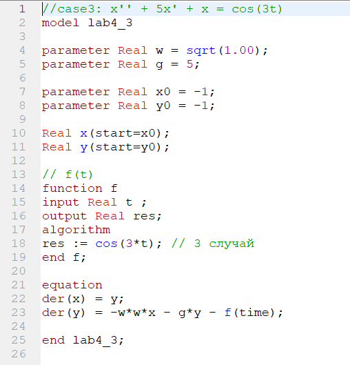{width=30%}

## Колебания гармонического осциллятора c затуханием и под действием внешней силы 

14. Решение для случая №3 в OpenModelica

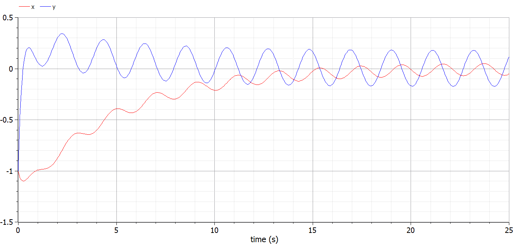{width=70%}

## Колебания гармонического осциллятора c затуханием и под действием внешней силы 

15. Фазовый портрет для случая №3 в OpenModelica

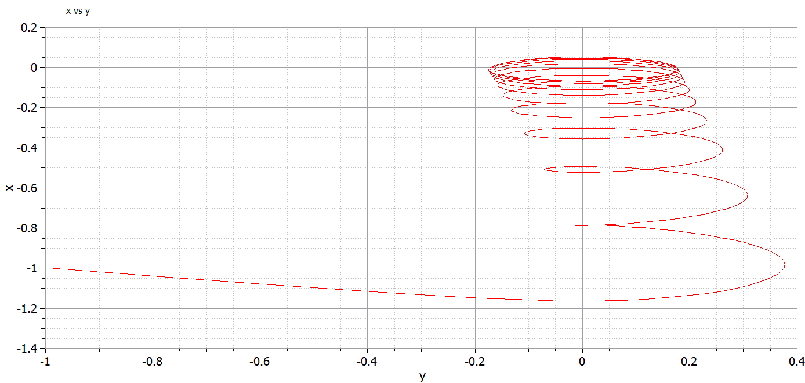{width=70%}

## Колебания гармонического осциллятора c затуханием и под действием внешней силы 

16. Листинг программы на Julia для случая №3 

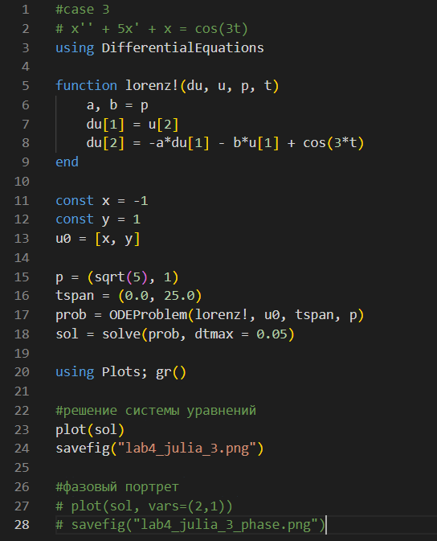{width=30%}

## Колебания гармонического осциллятора c затуханием и под действием внешней силы 

17. Решение для случая №3 на Julia

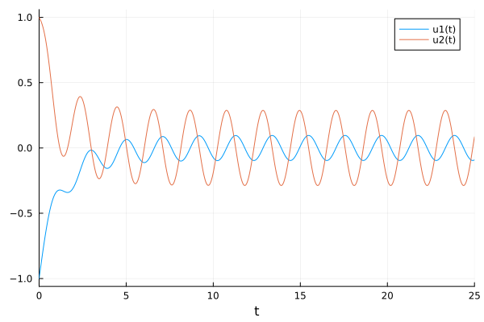{width=50%}

## Колебания гармонического осциллятора c затуханием и под действием внешней силы 

18. Фазовый портрет для случая №3 на Julia

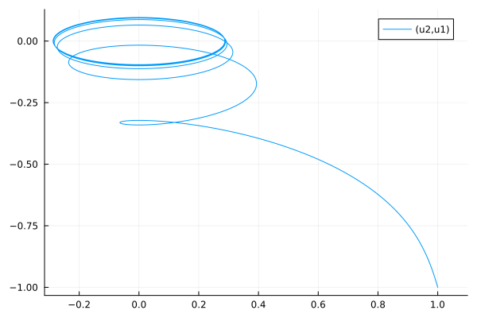{width=50%}

# Результаты

1. Разобралась в понятии гармонического осциллятора
2. Ознакомилась с уравнением свободных колебаний гармонического осциллятора
3. Построила фазовый портрет гармонического осциллятора и решение уравнения гармонического осциллятора для следующих случаев:
    - Колебания гармонического осциллятора без затуханий и без действий внешней силы 
    - Колебания гармонического осциллятора c затуханием и без действий внешней силы
    - Колебания гармонического осциллятора c затуханием и под действием внешней силы

## Вывод

В ходе лабораторной работы нам удалось построить фазовый портрет гармонического осциллятора и решить решение уравнения гармонического осциллятора для следующих случаев:
    
- колебания гармонического осциллятора без затуханий и без действий внешней силы 

- Колебания гармонического осциллятора c затуханием и без действий внешней силы

- Колебания гармонического осциллятора c затуханием и под действием внешней силы

Также нам удалось реализовать решение данной задачи на двух языках программирования: OpenModelica и Julia.
