---
# Front matter
lang: ru-RU
title: "Отчёт по лабораторной работе №4"
subtitle: "Модель гармонических колебаний"
author: "Голощапова Ирина Борисовна"

# Formatting
toc-title: "Содержание"
toc: true # Table of contents
toc_depth: 2
lof: true # List of figures
lot: true # List of tables
fontsize: 12pt
linestretch: 1.5
papersize: a4paper
documentclass: scrreprt
polyglossia-lang: russian
polyglossia-otherlangs: english
mainfont: PT Serif
romanfont: PT Serif
sansfont: PT Sans
monofont: PT Mono
mainfontoptions: Ligatures=TeX
romanfontoptions: Ligatures=TeX
sansfontoptions: Ligatures=TeX,Scale=MatchLowercase
monofontoptions: Scale=MatchLowercase
indent: true
pdf-engine: lualatex
header-includes:
  - \linepenalty=10 # the penalty added to the badness of each line within a paragraph (no associated penalty node) Increasing the value makes tex try to have fewer lines in the paragraph.
  - \interlinepenalty=0 # value of the penalty (node) added after each line of a paragraph.
  - \hyphenpenalty=50 # the penalty for line breaking at an automatically inserted hyphen
  - \exhyphenpenalty=50 # the penalty for line breaking at an explicit hyphen
  - \binoppenalty=700 # the penalty for breaking a line at a binary operator
  - \relpenalty=500 # the penalty for breaking a line at a relation
  - \clubpenalty=150 # extra penalty for breaking after first line of a paragraph
  - \widowpenalty=150 # extra penalty for breaking before last line of a paragraph
  - \displaywidowpenalty=50 # extra penalty for breaking before last line before a display math
  - \brokenpenalty=100 # extra penalty for page breaking after a hyphenated line
  - \predisplaypenalty=10000 # penalty for breaking before a display
  - \postdisplaypenalty=0 # penalty for breaking after a display
  - \floatingpenalty = 20000 # penalty for splitting an insertion (can only be split footnote in standard LaTeX)
  - \raggedbottom # or \flushbottom
  - \usepackage{float} # keep figures where there are in the text
  - \floatplacement{figure}{H} # keep figures where there are in the text
---

# Цель работы

Изучить понятие гармонического осциллятора, построить фазовый портрет и найти решение уравнения гармонического осциллятора.

# Библиография
1. [Git - система контроля версий](https://github.com/)

2. [Дифференциальные уравнения](https://ru.wikipedia.org/wiki/Дифференциальное_уравнение)

3. [Язык программирования - Julia](https://julialang.org/)

4. [Решение ДУ на языке программирование Julia](https://nextjournal.com/sosiris-de/ode-diffeq)

5. [Работа с OpenModelica](https://openmodelica.org/download/download-linux/)

6. [Julia и фазовые портреты динамических систем](https://habr.com/ru/post/428984/)

# Задачи лабораторной работы

1. Разобраться в понятии гармонического осциллятора
2. Ознакомиться с уравнением свободных колебаний гармонического осциллятора
3. Построить фазовый портрет гармонического осциллятора и решение уравнения гармонического осциллятора для следующих случаев:
    - Колебания гармонического осциллятора без затуханий и без действий внешней силы 
    - Колебания гармонического осциллятора c затуханием и без действий внешней силы
    - Колебания гармонического осциллятора c затуханием и под действием внешней силы

# Теоретическая справка

Движение грузика на пружинке, маятника, заряда в электрическом контуре, а также эволюция во времени многих систем в физике, химии, биологии и других науках при определенных предположениях можно описать одним и тем же
дифференциальным уравнением, которое в теории колебаний выступает в качестве основной модели. Эта модель называется линейным гармоническим осциллятором.
Уравнение свободных колебаний гармонического осциллятора имеет следующий вид (рис. @fig:01): 

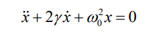{#fig:01 width=30%}

где x – переменная, описывающая состояние системы (смещение грузика, заряд конденсатора и т.д.), у – параметр, характеризующий потери энергии (трение в механической системе, сопротивление в контуре), w0 – собственная частота колебаний, t – время

Уравнение второго порядка (2) можно представить в виде системы двух уравнений первого порядка (рис. @fig:02): 

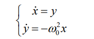{#fig:02 width=30%}

Начальные условия дли системы тогда примут вид (рис. @fig:03): 

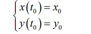{#fig:03 width=30%}

Независимые переменные x, y определяют пространство, в котором
«движется» решение. Это фазовое пространство системы, поскольку оно двумерно будем называть его фазовой плоскостью.

Значение фазовых координат x, y в любой момент времени полностью
определяет состояние системы. Решению уравнения движения как функции времени отвечает гладкая кривая в фазовой плоскости. Она называется фазовой траекторией. Если множество различных решений (соответствующих различным начальным условиям) изобразить на одной фазовой плоскости, возникает общая картина поведения системы. Такую картину, образованную набором фазовых
траекторий, называют фазовым портретом.

# Условие задачи (вариант №7)

Постройте фазовый портрет гармонического осциллятора и решение уравнения гармонического осциллятора для следующих случаев

1. Колебания гармонического осциллятора без затуханий и без действий внешней силы

    x'' + 7x = 0
2. Колебания гармонического осциллятора c затуханием и без действий внешней силы
    
    x'' + 2x' + 6x = 0
3. Колебания гармонического осциллятора c затуханием и под действием внешней силы
    
    x'' + 5x + x = cos(3t)

# Выполнение лабораторной работы

## Реализация в OpenModelica. Случай №1
### Колебания гармонического осциллятора без затуханий и без действий внешней силы

Для начала реализуем данную задачу в OpenModelica.

    //case1: x''+ 7x = 0
    model lab4_1 
    //x'' + g* x' + w^2* x = f(t) 
    //w - частота 
    //g - затухание 
    parameter Real w = sqrt(7.00);  
    parameter Real g =0;  

    parameter Real x0 = -1; 
    parameter Real y0 = -1; 

    Real x(start=x0); 
    Real y(start=y0); 

    // f(t) 
    function f 
    input Real t ; 
    output Real res; 
    algorithm  
    res := 0; 
    end f; 
    
    equation 
    der(x) = y; 
    der(y) = -w*w*x - g*y + f(time); 
    end lab4_1;

В результате получим следующее решение (рис. @fig:04):

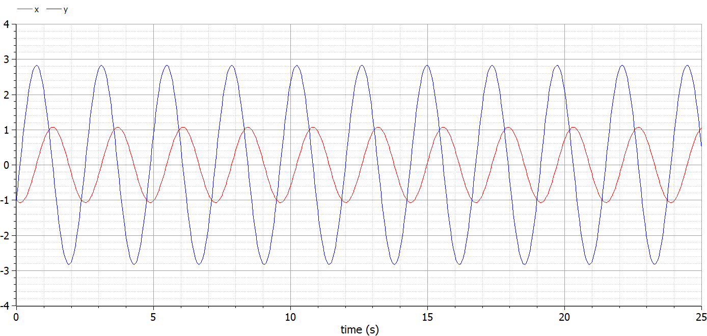{#fig:04 width=86%}

Фазовый портрет для первого случая примет следующий вид (рис. @fig:05):

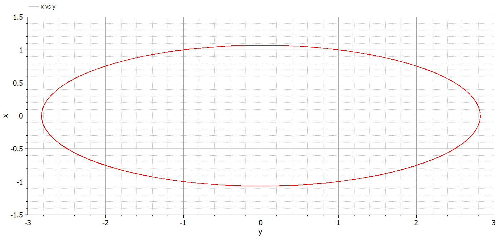{#fig:05 width=86%}

## Реализация на Julia. Случай №1
### Колебания гармонического осциллятора без затуханий и без действий внешней силы

    #case 1
    # x'' + 7x = 0
    using DifferentialEquations

    function lorenz!(du, u, p, t)
        a = p
        du[1] = u[2]
        du[2] = -a*u[1]
    end

    const x = -1
    const y = 1
    u0 = [x, y]

    p = (7)
    tspan = (0.0, 25.0)
    prob = ODEProblem(lorenz!, u0, tspan, p)
    sol = solve(prob, dtmax = 0.05)

    using Plots; gr()

    #решение системы уравнений
    plot(sol)
    savefig("lab4_julia_1.png")

    #фазовый портрет
    #plot(sol, vars=(2,1))
    #savefig("lab4_julia_1_phase.png")

В результате получим следующее решение (рис. @fig:06):

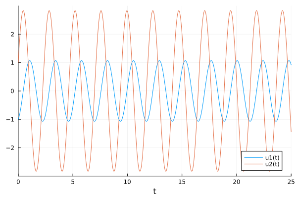{#fig:06 width=86%}

Фазовый портрет для первого случая примет следующий вид (рис. @fig:07):

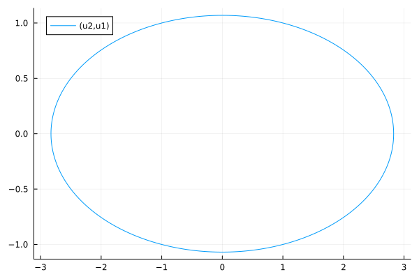{#fig:07 width=86%}

## Реализация в OpenModelica. Случай №2
### Колебания гармонического осциллятора c затуханием и без действий внешней силы

    //case2: x'' + 2x' + 6x = 0
    model lab4_2

    parameter Real w = sqrt(6.00);  
    parameter Real g = 2;  

    parameter Real x0 = -1; 
    parameter Real y0 = -1; 

    Real x(start=x0); 
    Real y(start=y0); 

    // f(t) 
    function f 
    input Real t ; 
    output Real res; 
    algorithm  
    res := 0; 
    end f; 
    
    equation 
    der(x) = y; 
    der(y) = -w*w*x - g*y + f(time); 

    end lab4_2;

В результате получим следующее решение (рис. @fig:08):

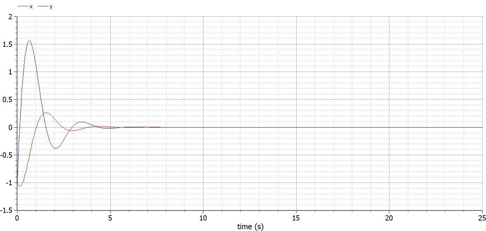{#fig:08 width=86%}

Фазовый портрет для второго случая примет следующий вид (рис. @fig:09):

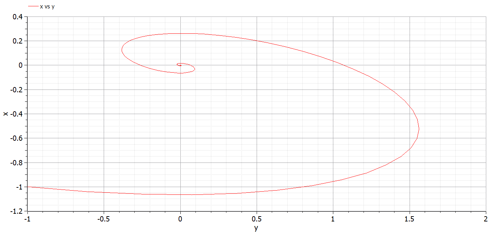{#fig:09 width=86%}

## Реализация на Julia. Случай №2
### Колебания гармонического осциллятора c затуханием и без действий внешней силы

    #case 2
    # x'' + 2x' + 6x = 0
    using DifferentialEquations

    function lorenz!(du, u, p, t)
        a, b = p
        du[1] = u[2]
        du[2] = -a*du[1] - b*u[1] 
    end

    const x = -1
    const y = 1
    u0 = [x, y]

    p = (sqrt(2), 6)
    tspan = (0.0, 25.0)
    prob = ODEProblem(lorenz!, u0, tspan, p)
    sol = solve(prob, dtmax = 0.05)

    using Plots; gr()

    #решение системы уравнений
    plot(sol)
    savefig("lab4_julia_2.png")

    #фазовый портрет
    #plot(sol, vars=(2,1))
    #savefig("lab4_julia_2_ph.png")

В результате получим следующее решение (рис. @fig:10):

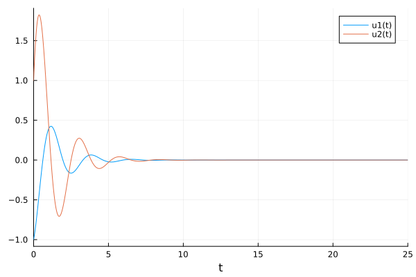{#fig:10 width=86%}

Фазовый портрет для второго случая примет следующий вид (рис. @fig:11):

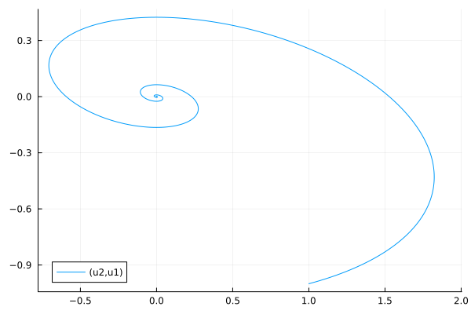{#fig:11 width=86%}

## Реализация в OpenModelica. Случай №3
### Колебания гармонического осциллятора c затуханием и под действием внешней силы

    //case3: x'' + 5x' + x = cos(3t)
    model lab4_3
    
    parameter Real w = sqrt(1.00);  
    parameter Real g = 5;  

    parameter Real x0 = -1; 
    parameter Real y0 = -1; 

    Real x(start=x0); 
    Real y(start=y0); 

    // f(t) 
    function f 
    input Real t ; 
    output Real res; 
    algorithm  
    res := cos(3*t); // 3 случай 
    end f; 
    
    equation 
    der(x) = y; 
    der(y) = -w*w*x - g*y - f(time); 

    end lab4_3;

В результате получим следующее решение (рис. @fig:12):

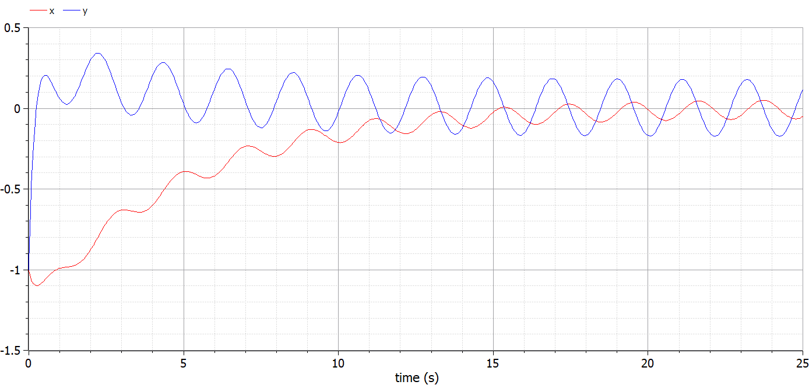{#fig:12 width=86%}

Фазовый портрет для третьего случая примет следующий вид (рис. @fig:13):

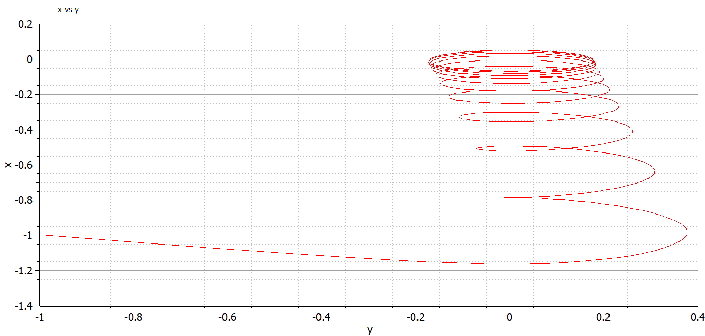{#fig:13 width=86%}

## Реализация на Julia. Случай №3
### Колебания гармонического осциллятора c затуханием и под действием внешней силы

    #case 3
    # x'' + 5x' + x = cos(3t)
    using DifferentialEquations

    function lorenz!(du, u, p, t)
        a, b = p
        du[1] = u[2]
        du[2] = -a*du[1] - b*u[1] + cos(3*t)
    end

    const x = -1
    const y = 1
    u0 = [x, y]

    p = (sqrt(5), 1)
    tspan = (0.0, 25.0)
    prob = ODEProblem(lorenz!, u0, tspan, p)
    sol = solve(prob, dtmax = 0.05)

    using Plots; gr()

    #решение системы уравнений
    plot(sol)
    savefig("lab4_julia_3.png")

    #фазовый портрет
    #plot(sol, vars=(2,1))
    #savefig("lab4_julia_3_phase.png")

В результате получим следующее решение (рис. @fig:14):

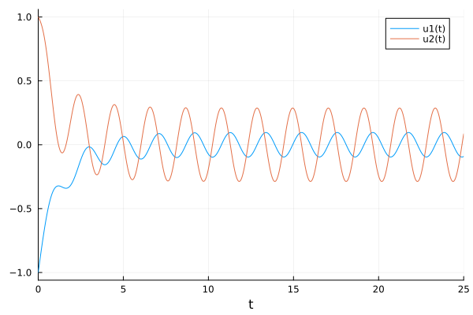{#fig:14 width=86%}

Фазовый портрет для второго случая примет следующий вид (рис. @fig:15):

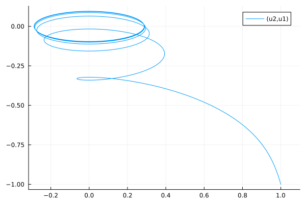{#fig:15 width=86%}

# Выводы

В ходе лабораторной работы нам удалось построить фазовый портрет гармонического осциллятора и решить решение уравнения гармонического осциллятора для следующих случаев:
    
- колебания гармонического осциллятора без затуханий и без действий внешней силы 

- Колебания гармонического осциллятора c затуханием и без действий внешней силы

- Колебания гармонического осциллятора c затуханием и под действием внешней силы

Также нам удалось реализовать решение данной задачи на двух языках программирования: OpenModelica и Julia.
