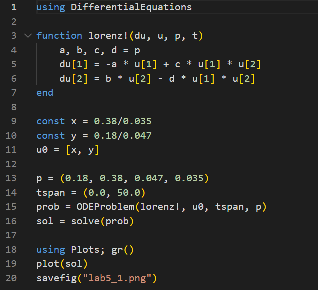

---
## Front matter
lang: ru-RU
title: Лабораторная работа №5
subtitle: Модель хищник-жертва
author:
  - Голощапова Ирина Борисовна
institute:
  - Российский университет дружбы народов, Москва, Россия
date: 11 февраля 2023

## i18n babel
babel-lang: russian
babel-otherlangs: english

## Fonts
mainfont: PT Serif
romanfont: PT Serif
sansfont: PT Sans
monofont: PT Mono
mainfontoptions: Ligatures=TeX
romanfontoptions: Ligatures=TeX
sansfontoptions: Ligatures=TeX,Scale=MatchLowercase
monofontoptions: Scale=MatchLowercase,Scale=0.9

## Formatting pdf
toc: false
toc-title: Содержание
slide_level: 2
aspectratio: 169
section-titles: true
theme: metropolis
header-includes:
 - \metroset{progressbar=frametitle,sectionpage=progressbar,numbering=fraction}
 - '\makeatletter'
 - '\beamer@ignorenonframefalse'
 - '\makeatother'
---

# Информация

## Докладчик

:::::::::::::: {.columns align=center}
::: {.column width="70%"}

  * Голощапова Ирина Борисовна
  * студентка уч. группы НФИбд-01-20
  * Российский университет дружбы народов
  * [1032201666@pfur.ru](mailto:1032201666@pfur.ru)
  * <https://github.com/ibgoloshchapowa>

:::
::: {.column width="30%"}

:::
::::::::::::::

# Вводная часть

## Актуальность

Моде́ль Ло́тки — Вольте́рры — модель взаимодействия двух видов типа «хищник — жертва», названная в честь её авторов, которые предложили модельные уравнения независимо друг от друга.

Такие уравнения можно использовать для моделирования систем «хищник — жертва», «паразит — хозяин», конкуренции и других видов взаимодействия между двумя видами.

## Объект и предмет исследования

- Простейшая модель взаимодействия двух видов типа «хищник — жертва» - модель Лотки-Вольтерры.
- Язык программирования Julia
- Язык моделирования OpenModelica

## Цели и задачи

1. Построить график зависимости численности хищников от численности жертв.

2.  Построить графики изменения численности хищников и численности жертв при заданных начальных условиях.

3. Найти стационарное состояние системы.

## Условие задачи. Вариант №7

Для модели «хищник-жертва»:

{width=40%}

Постройте график зависимости численности хищников от численности жертв, а также графики изменения численности хищников и численности жертв при
следующих начальных условиях:

x0 = 12, 

y0 = 17.

# Выполнение работы
# Построение модели "хищник-жертва" на языке OpenModelica

## Построение модели "хищник-жертва" на языке OpenModelica
1. Листинг программы в OpenModelica

{width=50%}

## Построение модели "хищник-жертва" на языке OpenModelica

2. Построение модели в OpenModelica 

{width=70%}

## Фазовый портрет модели "хищник-жертва" на языке OpenModelica

3. Фазовый портрет модели в OpenModelica выглядит следующим образом

{width=70%}

## Стационарное состояние системы на языке OpenModelica

4. Листинг программы в OpenModelica

{width=50%}

## Стационарное состояние системы на языке Julia

5. Стационарного состояние системы в OpenModelica

{width=50%}

x0 = 10.8571429, y0 = 3.82978723

# Построение модели "хищник-жертва" на языке Julia

## Построение модели "хищник-жертва" на языке Julia
6. Листинг программы в Julia

{width=30%}

## Построение модели "хищник-жертва" на языке Julia

7. Построение модели в Julia 

{width=50%}

## Фазовый портрет модели "хищник-жертва" на языке Julia

8. Фазовый портрет модели в Julia выглядит следующим образом

{width=50%}

## Стационарное состояние системы на языке Julia

9. Листинг программы в Julia

{width=40%}

## Стационарное состояние системы на языке Julia

10. Стационарного состояние системы в Julia

{width=40%}

x0 = 10.8571429, y0 = 3.82978723

# Результаты
## Вывод

В ходе лабораторной работы нам удалось:

1. Построить график зависимости численности хищников от численности жертв.

2. Построить графики изменения численности хищников и численности жертв при заданных начальных условиях.

3. Найти стационарное состояние системы. 

Мы реализовали решение данной задачи на двух языках:  моделирования - OpenModelica и программирования - Julia.
