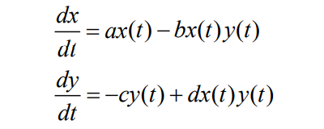
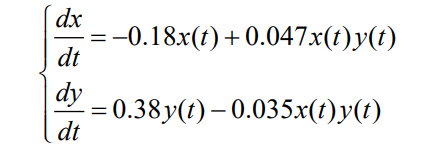
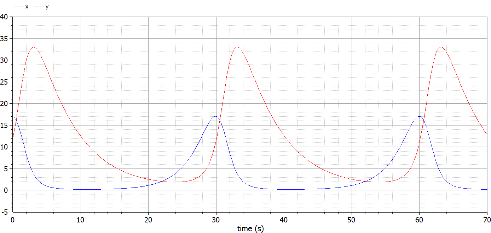
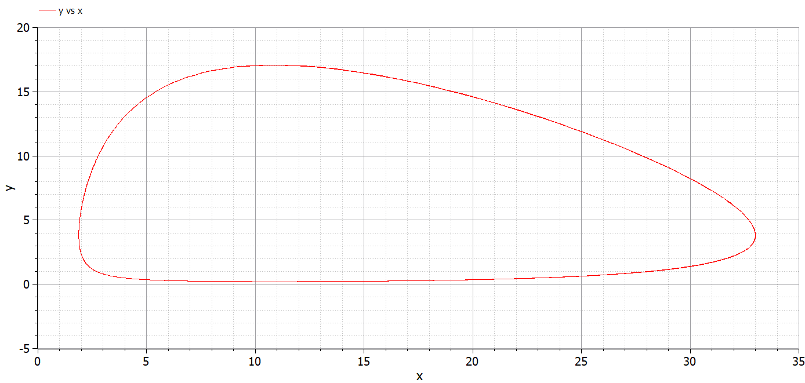
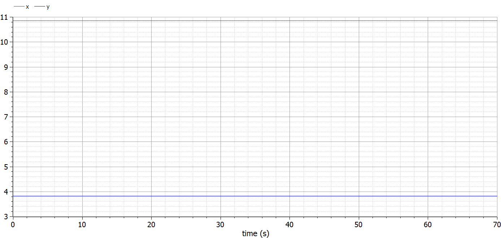
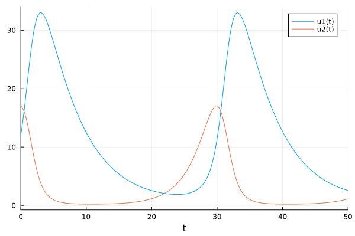
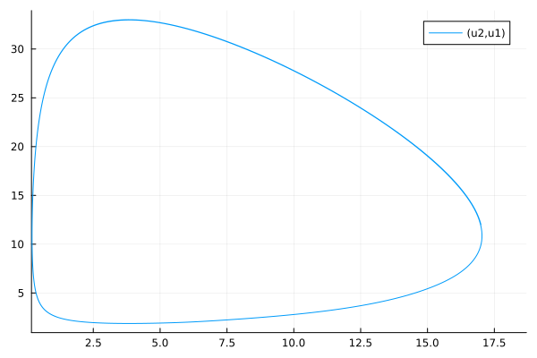
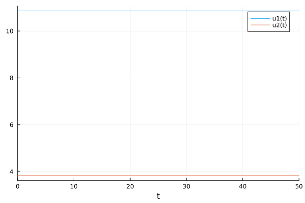

---
# Front matter
lang: ru-RU
title: "Отчёт по лабораторной работе №5"
subtitle: "Модель хищник-жертва"
author: "Голощапова Ирина Борисовна"

# Formatting
toc-title: "Содержание"
toc: true # Table of contents
toc_depth: 2
lof: true # List of figures
lot: true # List of tables
fontsize: 12pt
linestretch: 1.5
papersize: a4paper
documentclass: scrreprt
polyglossia-lang: russian
polyglossia-otherlangs: english
mainfont: PT Serif
romanfont: PT Serif
sansfont: PT Sans
monofont: PT Mono
mainfontoptions: Ligatures=TeX
romanfontoptions: Ligatures=TeX
sansfontoptions: Ligatures=TeX,Scale=MatchLowercase
monofontoptions: Scale=MatchLowercase
indent: true
pdf-engine: lualatex
header-includes:
  - \linepenalty=10 # the penalty added to the badness of each line within a paragraph (no associated penalty node) Increasing the value makes tex try to have fewer lines in the paragraph.
  - \interlinepenalty=0 # value of the penalty (node) added after each line of a paragraph.
  - \hyphenpenalty=50 # the penalty for line breaking at an automatically inserted hyphen
  - \exhyphenpenalty=50 # the penalty for line breaking at an explicit hyphen
  - \binoppenalty=700 # the penalty for breaking a line at a binary operator
  - \relpenalty=500 # the penalty for breaking a line at a relation
  - \clubpenalty=150 # extra penalty for breaking after first line of a paragraph
  - \widowpenalty=150 # extra penalty for breaking before last line of a paragraph
  - \displaywidowpenalty=50 # extra penalty for breaking before last line before a display math
  - \brokenpenalty=100 # extra penalty for page breaking after a hyphenated line
  - \predisplaypenalty=10000 # penalty for breaking before a display
  - \postdisplaypenalty=0 # penalty for breaking after a display
  - \floatingpenalty = 20000 # penalty for splitting an insertion (can only be split footnote in standard LaTeX)
  - \raggedbottom # or \flushbottom
  - \usepackage{float} # keep figures where there are in the text
  - \floatplacement{figure}{H} # keep figures where there are in the text
---

# Цель работы

Изучить модель "хищник-жертва" - модель Лотки-Вольтерры.

# Библиография
1. [Git - система контроля версий](https://github.com/)

2. [Дифференциальные уравнения](https://ru.wikipedia.org/wiki/Дифференциальное_уравнение)

3. [Язык программирования - Julia](https://julialang.org/)

4. [Решение ДУ на языке программирование Julia](https://nextjournal.com/sosiris-de/ode-diffeq)

5. [Работа с OpenModelica](https://openmodelica.org/download/download-linux/)

6. [Julia и фазовые портреты динамических систем](https://habr.com/ru/post/428984/)

# Задачи лабораторной работы

1. Построить график зависимости численности хищников от численности жертв.

2.  Построить графики изменения численности хищников и численности жертв при заданных начальных условиях.

3. Найти стационарное состояние системы.

# Теоретическая справка

## Модель хищник-жертва

Простейшая модель взаимодействия двух видов типа «хищник — жертва» - модель Лотки-Вольтерры. Данная двувидовая модель основывается на следующих предположениях:

1. Численность популяции жертв x и хищников y зависят только от времени (модель не учитывает пространственное распределение популяции на занимаемой территории)

2. В отсутствии взаимодействия численность видов изменяется по модели Мальтуса, при этом число жертв увеличивается, а число хищников падает

3. Естественная смертность жертвы и естественная рождаемость хищника считаются несущественными

4. Эффект насыщения численности обеих популяций не учитывается

5. Скорость роста численности жертв уменьшается пропорционально
численности хищников

Система уравнений(рис. @fig:01):

{#fig:01 width=40%}

В этой модели x – число жертв, y - число хищников. Коэффициент a описывает скорость естественного прироста числа жертв в отсутствие хищников, с - естественное вымирание хищников, лишенных пищи в виде жертв. 

Вероятность взаимодействия жертвы и хищника считается пропорциональной как количеству
жертв, так и числу самих хищников (xy). Каждый акт взаимодействия уменьшает популяцию жертв, но способствует увеличению популяции хищников (члены -bxy и dxy в правой части уравнения). 

## Стационарное состояние

Математический анализ этой (жесткой) модели показывает, что имеется стационарное состояние, всякое же другое начальное состояние приводит к периодическому колебанию численности как жертв, так и хищников, так что по прошествии некоторого времени система возвращается в состояние B.

Стационарное состояние системы (положение равновесия, не зависящее от времени решение) будет в точке:

x0 = c/d,

y0 = a/b.

Если начальные значения задать в стационарном состоянии

x(0) = x0, 

y(0) = y0, 

то в любой момент времени
численность популяций изменяться не будет. При малом отклонении от положения равновесия численности как хищника, так и жертвы с течением времени не
возвращаются к равновесным значениям, а совершают периодические колебания вокруг стационарной точки. 

Амплитуда колебаний и их период определяется
начальными значениями численностей
x(0), y(0). Колебания совершаются в
противофазе 

# Условие задачи (вариант №7)

Для модели «хищник-жертва»(рис. @fig:02):

{#fig:02 width=40%}

Постройте график зависимости численности хищников от численности жертв,
а также графики изменения численности хищников и численности жертв при
следующих начальных условиях:
x0 = 12, y0 = 17.

# Выполнение лабораторной работы

## Реализация в OpenModelica. 

Для начала реализуем данную задачу в OpenModelica.
Зададим начальные значения, параметры и системы уравнений.

Листинг программы: 

    model lab5

    parameter Real a = 0.18; // коэффициент естественной смертности хищников
    parameter Real b = 0.38; // коэффициент естественного прироста жертв
    parameter Real c = 0.047; // коэффициент увеличения числа хищников
    parameter Real d = 0.035; // коэффициент смертности жертв 

    parameter Real x0 = 12;
    parameter Real y0 = 17;

    Real x(start=x0);
    Real y(start=y0);

    equation
      der(x) = -a*x + c*x*y;
      der(y) = b*y - d*x*y;

    annotation(experiment(StartTime = 0, StopTime = 70, Interval = 0.05));

    end lab5;

В результате получим следующее решение (рис. @fig:03):

{#fig:03 width=86%}

Фазовый портрет примет следующий вид (рис. @fig:04):

{#fig:04 width=86%}

## Нахождение стационарного состояния системы в OpenModelica

Для того, чтобы найти стационарное состояние системы нужно только поменять начальные условия:

x0 = c/d

y0 = a/b

В результате получим следующий листинг программы:

    model lab5_1
    parameter Real a = 0.18; // коэффициент естественной смертности хищников
    parameter Real b = 0.38; // коэффициент естественного прироста жертв
    parameter Real c = 0.047; // коэффициент увеличения числа хищников
    parameter Real d = 0.035; // коэффициент смертности жертв 

    parameter Real x0 = b / d;
    parameter Real y0 = a / c;

    Real x(start=x0);
    Real y(start=y0);

    equation
      der(x) = -a*x + c*x*y;
      der(y) = b*y - d*x*y;

    annotation(experiment(StartTime = 0, StopTime = 70, Interval = 0.05));
    end lab5_1;

Стационарное состояние системы  (рис. @fig:05): 

{#fig:05 width=86%}

x0 = 10.8571429

y0 = 3.82978723

## Реализация на Julia.

Согласно условию варианта №7 зададим начальные значения и реализуем решение поставленной задачи.

Листинг программы на языке Julia:

    using DifferentialEquations

    function lorenz!(du, u, p, t)
        a, b, c, d = p
        du[1] = -a * u[1] + c * u[1] * u[2]
        du[2] = b * u[2] - d * u[1] * u[2]
    end

    const x = 12 
    const y = 17
    u0 = [x, y]

    p = (0.18, 0.38, 0.047, 0.035)
    tspan = (0.0, 50.0)
    prob = ODEProblem(lorenz!, u0, tspan, p)
    sol = solve(prob)

    using Plots; gr()

    #решение
    plot(sol)
    savefig("lab5_solution.png")

    #фазовый портрет
    plot(sol, vars=(2,1))
    savefig("lab5.png")
    

В результате получим следующее решение (рис. @fig:06):

{#fig:06 width=86%}

Фазовый портрет примет следующий вид (рис. @fig:07):

{#fig:07 width=86%}

## Нахождение стационарного состояния системы на Julia

Для того, чтобы найти стационарное состояние системы необходимо в начальные значения подставить следующие формулы:

x0 = c/d

y0 = a/b

Листинг программы на языке Julia:

    using DifferentialEquations

    function lorenz!(du, u, p, t)
        a, b, c, d = p
        du[1] = -a * u[1] + c * u[1] * u[2]
        du[2] = b * u[2] - d * u[1] * u[2]
    end

    const x = 0.38/0.035  
    const y = 0.18/0.047     
    u0 = [x, y]

    p = (0.18, 0.38, 0.047, 0.035)
    tspan = (0.0, 50.0)
    prob = ODEProblem(lorenz!, u0, tspan, p)
    sol = solve(prob)

    using Plots; gr()
    plot(sol)
    savefig("lab5_1.png")

Стационарное состояние системы на Julia  (рис. @fig:08): 

{#fig:08 width=86%}

x0 = 10.8571429

y0 = 3.82978723    

# Выводы

В ходе лабораторной работы нам удалось познакомиться с простейшей моделью взаимодействия двух видов типа «хищник — жертва» - моделью Лотки-Вольтерры. 
Также мы реализовали решение данной задачи и построили графики зависимостей на языках: моделирования - OpenModelica и программирования - Julia.
