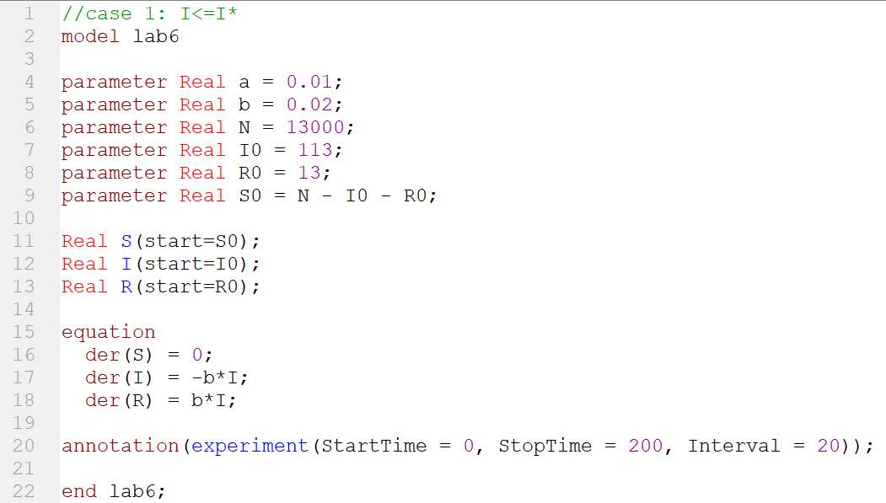
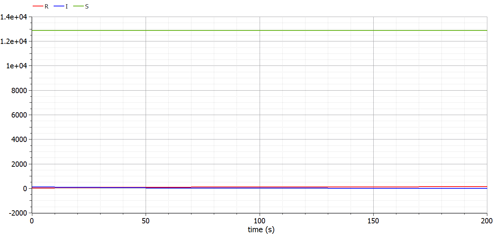
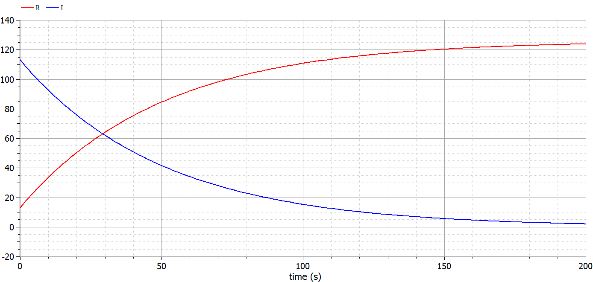
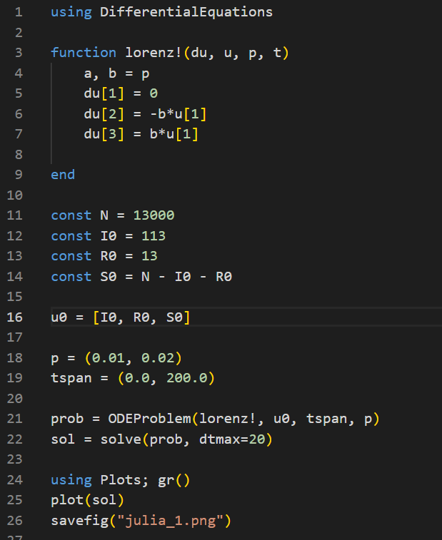
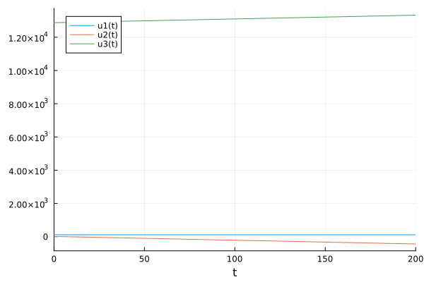
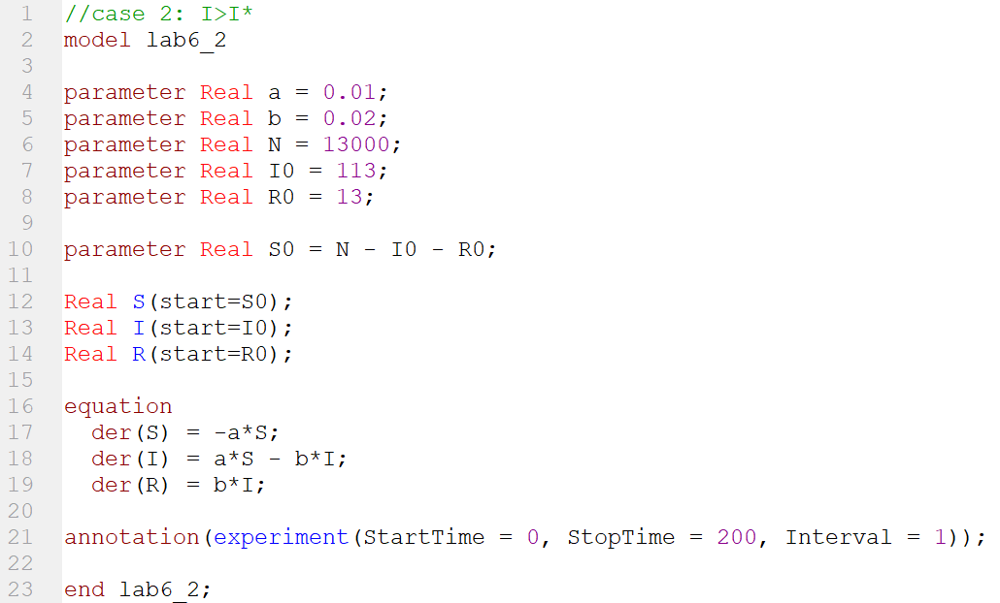
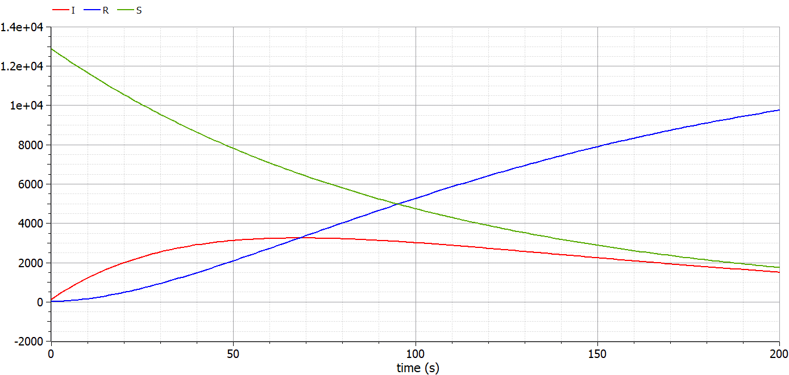
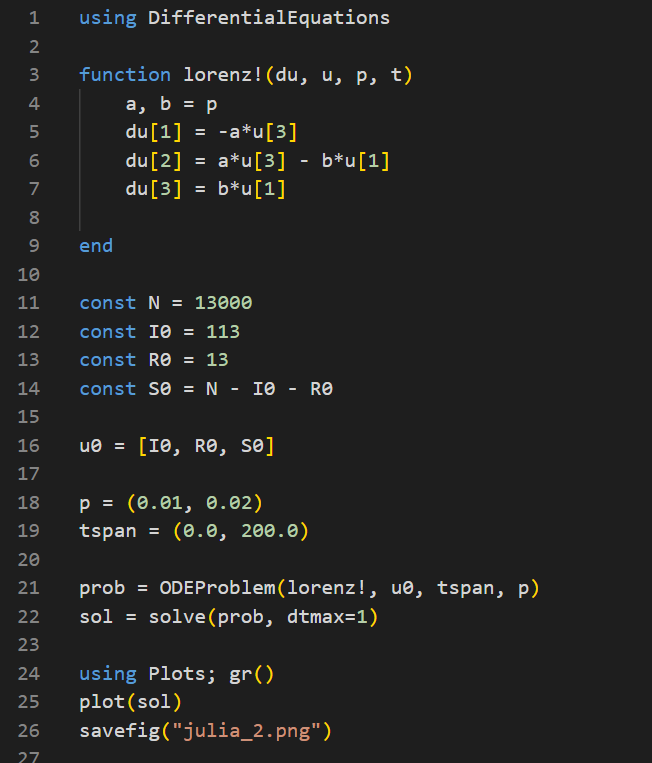
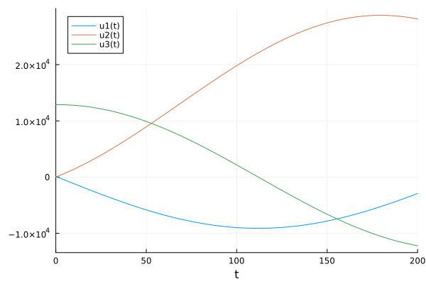

---
## Front matter
lang: ru-RU
title: Лабораторная работа №6
subtitle: "Задача об эпидемии"
author:
  - Голощапова Ирина Борисовна
institute:
  - Российский университет дружбы народов, Москва, Россия
date: 17 марта 2023

## i18n babel
babel-lang: russian
babel-otherlangs: english

## Fonts
mainfont: PT Serif
romanfont: PT Serif
sansfont: PT Sans
monofont: PT Mono
mainfontoptions: Ligatures=TeX
romanfontoptions: Ligatures=TeX
sansfontoptions: Ligatures=TeX,Scale=MatchLowercase
monofontoptions: Scale=MatchLowercase,Scale=0.9

## Formatting pdf
toc: false
toc-title: Содержание
slide_level: 2
aspectratio: 169
section-titles: true
theme: metropolis
header-includes:
 - \metroset{progressbar=frametitle,sectionpage=progressbar,numbering=fraction}
 - '\makeatletter'
 - '\beamer@ignorenonframefalse'
 - '\makeatother'
---

# Информация

## Докладчик

:::::::::::::: {.columns align=center}
::: {.column width="70%"}

  * Голощапова Ирина Борисовна
  * студентка уч. группы НФИбд-01-20
  * Российский университет дружбы народов
  * [1032201666@pfur.ru](mailto:1032201666@pfur.ru)
  * <https://github.com/ibgoloshchapowa>

:::
::: {.column width="30%"}

:::
::::::::::::::

# Вводная часть

## Актуальность

Эпидемиология из-за некоторого стечения обстоятельств стала очень популярной за последний год. Интерес к моделированию эпидемий стал возникать у многих и уже всё больше людей знают о SIR модели.

Данная модель хорошо подходит для моделирования эпидемий многих инфекционных заболеваний, включая ветрянку, корь, краснуху и многие другие. Вспышки подобных заболеваний обычно имеют циклическую природу, так как со временем число восприимчивых к заболеванию людей падает, и, до тех пор, пока класс восприимчивых не восполнится за счет новорожденных или приезжих, болезнь распространяться не может.

## Объект и предмет исследования

- Простейшая модель эпидемии
- Язык программирования Julia
- Язык моделирования OpenModelica

## Цели и задачи

-  Рассмотреть простейшую модель эпидемии
-  Задать начальные условия и коеффициенты пропорциональности.

-  Построить графики изменения числа особей трех групп:
    
    1. восприимчивые к болезни, но пока здоровые особи: $S(t)$
    
    2. инфицированные особи: $I(t)$

    3. здоровые особи с иммунитетом к болезни: $R(t)$

-  Рассмотреть, как будет протекать эпидемия в случае: 
    
    1. если $I(0) ≤ I*$ 
   
    2. если $I(0) > I*$ 

## Условие задачи. Вариант №7

На одном острове вспыхнула эпидемия. 
Известно, что из всех проживающих на острове ($N = 13 000$) в момент начала эпидемии ($t=0$) число заболевших людей
(являющихся распространителями инфекции) $I(0) = 113$, А число здоровых людей с иммунитетом к болезни $R(0) = 13$. Таким образом, число людей восприимчивых к болезни, но пока здоровых, в начальный момент времени $S(0) = N - I(0) - R(0)$.
Постройте графики изменения числа особей в каждой из трех групп.
Рассмотрите, как будет протекать эпидемия в случае:

1. если $I(0) ≤ I*$

2. если $I(0) > I*$

# Выполнение работы
# Построение модели эпидемии. Случай 1

## Построение модели на языке OpenModelica. Случай 1
1. Листинг программы в OpenModelica, когда $I(0) ≤ I*$

{width=50%}

## Построение модели  на языке OpenModelica. Случай 1

2. Получаем следующий результат:

{#fig:01 width=50%}

## Построение модели  на языке OpenModelica. Случай 1

3. Графики без отображения $S(t)$:

{#fig:02 width=50%}

# Построение модели эпидемии на языке Julia. Случай 1

## Построение модели на языке Julia. Случай 1 
4. Листинг программы на Julia

{width=30%}

## Построение модели на языке Julia. Случай 1 

5. Результат на Julia выглядит следующим образом

{width=50%}

# Построение модели эпидемии. Случай 2

## Построение модели на языке OpenModelica. Случай 2
6. Листинг программы в OpenModelica, когда $I(0) > I*$

{width=50%}

## Построение модели  на языке OpenModelica. Случай 2

7. Получаем следующий результат:

{#fig:01 width=50%}

# Построение модели эпидемии на языке Julia. Случай 2

## Построение модели на языке Julia. Случай 2 
8. Листинг программы на Julia

{width=30%}

## Построение модели на языке Julia. Случай 1 

9. Результат на Julia выглядит следующим образом

{width=50%}

# Результаты
## Вывод

В ходе лабораторной работы нам удалось 

-  Построить графики изменения числа особей трех групп:
    
    1. восприимчивые к болезни, но пока здоровые особи: $S(t)$
    
    2. инфицированные особи, которые также являются распространителями инфекции: $I(t)$

    3. здоровые особи с иммунитетом к болезни: $R(t)$

-  Рассмотреть, как будет протекать эпидемия в случае: 
    
    1. если $I(0) ≤ I*$ 
   
    2. если $I(0) > I*$ 

