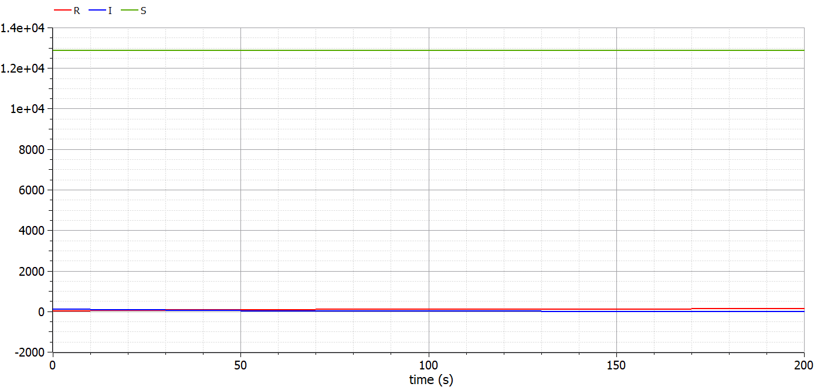
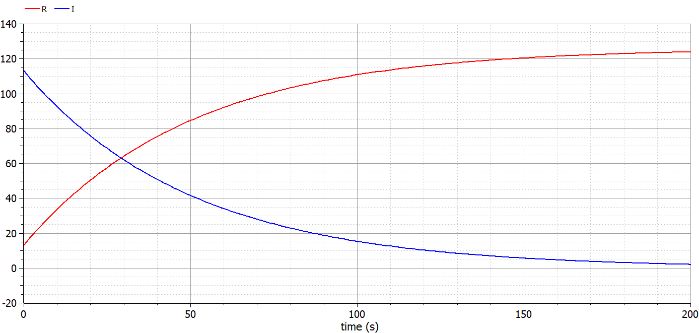
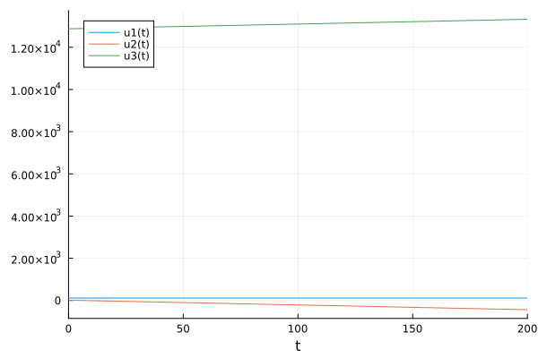
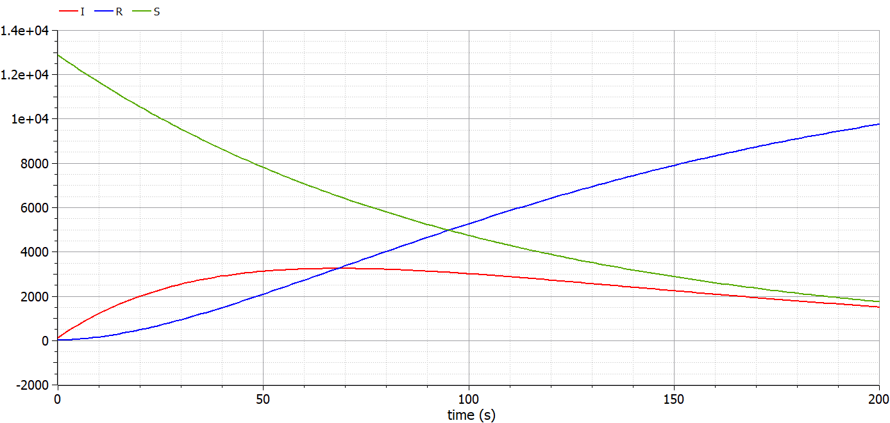
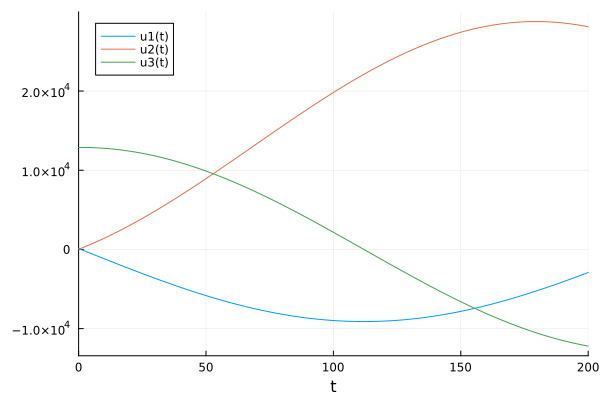

---
# Front matter
lang: ru-RU
title: "Отчёт по лабораторной работе №6"
subtitle: "Задача об эпидемии SIR"
author: "Голощапова Ирина Борисовна"

# Formatting
toc-title: "Содержание"
toc: true # Table of contents
toc_depth: 2
lof: true # List of figures
lot: true # List of tables
fontsize: 12pt
linestretch: 1.5
papersize: a4paper
documentclass: scrreprt
polyglossia-lang: russian
polyglossia-otherlangs: english
mainfont: PT Serif
romanfont: PT Serif
sansfont: PT Sans
monofont: PT Mono
mainfontoptions: Ligatures=TeX
romanfontoptions: Ligatures=TeX
sansfontoptions: Ligatures=TeX,Scale=MatchLowercase
monofontoptions: Scale=MatchLowercase
indent: true
pdf-engine: lualatex
header-includes:
  - \linepenalty=10 # the penalty added to the badness of each line within a paragraph (no associated penalty node) Increasing the value makes tex try to have fewer lines in the paragraph.
  - \interlinepenalty=0 # value of the penalty (node) added after each line of a paragraph.
  - \hyphenpenalty=50 # the penalty for line breaking at an automatically inserted hyphen
  - \exhyphenpenalty=50 # the penalty for line breaking at an explicit hyphen
  - \binoppenalty=700 # the penalty for breaking a line at a binary operator
  - \relpenalty=500 # the penalty for breaking a line at a relation
  - \clubpenalty=150 # extra penalty for breaking after first line of a paragraph
  - \widowpenalty=150 # extra penalty for breaking before last line of a paragraph
  - \displaywidowpenalty=50 # extra penalty for breaking before last line before a display math
  - \brokenpenalty=100 # extra penalty for page breaking after a hyphenated line
  - \predisplaypenalty=10000 # penalty for breaking before a display
  - \postdisplaypenalty=0 # penalty for breaking after a display
  - \floatingpenalty = 20000 # penalty for splitting an insertion (can only be split footnote in standard LaTeX)
  - \raggedbottom # or \flushbottom
  - \usepackage{float} # keep figures where there are in the text
  - \floatplacement{figure}{H} # keep figures where there are in the text
---

# Цели и задачи лабораторной работы

## Цель работы

Рассмотреть простейшую модель эпидемии.

## Задачи работы

-  Согласно своему варианту задать начальные условия и коеффициенты пропорциональности.

-  Построить графики изменения числа особей трех групп:
    
    1. восприимчивые к болезни, но пока здоровые особи: $S(t)$
    
    2. инфицированные особи, которые также являются распространителями инфекции: $I(t)$

    3. здоровые особи с иммунитетом к болезни: $R(t)$

-  Рассмотреть, как будет протекать эпидемия в случае: 
    
    1. если $I(0) ≤ I*$ 
   
    2. если $I(0) > I*$ 

# Теоретическая справка

## Задача об эпидемии

Рассмотрим простейшую модель эпидемии. Предположим, что некая популяция, состоящая из $N$ особей, (считаем, что популяция изолирована) подразделяется на три группы. Первая группа - это восприимчивые к болезни, но
пока здоровые особи, обозначим их через $S(t)$. Вторая группа – это число инфицированных особей, которые также при этом являются распространителями
инфекции, обозначим их $I(t)$. А третья группа обозначающаяся через $R(t)$ – это здоровые особи с иммунитетом к болезни. 

До того, как число заболевших не превышает критического значения $I*$, считаем, что все больные изолированы и не заражают здоровых. Когда $I(t)>I*$,
тогда инфицирование способны заражать восприимчивых к болезни особей.

Таким образом, скорость изменения числа $S(t)$ меняется по следующему закону:

$$
\begin{equation}
{\frac{dS}{dt}}=  
\left\{
    \begin{array}{ll}

        \\-\alpha*S, если I(t) > I* \\
        \\ 0,  если I(t) ≤ I*

\end{array}\right.
\end{equation} 
$$

Поскольку каждая восприимчивая к болезни особь, которая, в конце концов, заболевает, сама становится инфекционной, то скорость изменения числа инфекционных особей представляет разность за единицу времени между
заразившимися и теми, кто уже болеет и лечится, т.е.:

$$
\begin{equation}
{\frac{dI}{dt}}=  
\left\{
    \begin{array}{ll}

        \\-\alpha S - \beta I, если I(t) > I* \\
        \\ -\beta I,  если I(t) ≤ I*

\end{array}\right.
\end{equation} 
$$

А скорость изменения выздоравливающих особей (при этом приобретающие иммунитет к болезни):

$$
\begin{equation}
    \frac{dR}{dt} = \beta I
\end{equation}
$$

Постоянные пропорциональности
$\alpha$, $\beta$ - это коэффициенты заболеваемости и выздоровления соответственно.

Для того, чтобы решения соответствующих уравнений определялось однозначно, необходимо задать начальные условия .Считаем, что на начало эпидемии в момент времени $t = 0$ нет особей с иммунитетом к болезни $R(0)=0$, а
число инфицированных и восприимчивых к болезни особей $I(0)$ и $S(0)$ соответственно. Для анализа картины протекания эпидемии необходимо рассмотреть два случая:
 $I(0) ≤ I*$ и $I(0)>I*$ .

# Условие задачи (вариант №7)

На одном острове вспыхнула эпидемия. 
Известно, что из всех проживающих на острове ($N = 13 000$) в момент начала эпидемии ($t=0$) число заболевших людей
(являющихся распространителями инфекции) $I(0) = 113$, А число здоровых людей с иммунитетом к болезни $R(0) = 13$. Таким образом, число людей восприимчивых к болезни, но пока здоровых, в начальный момент времени $S(0) = N - I(0) - R(0)$.
Постройте графики изменения числа особей в каждой из трех групп.
Рассмотрите, как будет протекать эпидемия в случае:

1. если $I(0) ≤ I*$

2. если $I(0) > I*$

# Выполнение лабораторной работы

## Реализация в OpenModelica. Случай 1 

Для начала реализуем решение данной задачи в OpenModelica:

Листинг программы для первого случая, когда $I(0) ≤ I*$ 

        //case 1: I<=I*
        model lab6

        parameter Real a = 0.01;
        parameter Real b = 0.02;
        parameter Real N = 13000;
        parameter Real I0 = 113;
        parameter Real R0 = 13;
        parameter Real S0 = N - I0 - R0;

        Real S(start=S0);
        Real I(start=I0);
        Real R(start=R0);

        equation
        der(S) = 0;
        der(I) = -b*I;
        der(R) = b*I;

        annotation(experiment(StartTime = 0, StopTime = 200, Interval = 20));

        end lab6;

В результате получим следующие графики (рис. @fig:01):

{#fig:01 width=40%}

Так как значение $S(t)$ сильно отличается от $I(t)$ и $R(t)$, плохо виден характер изменения значений, поэтому попробуем вывести только функции  $I(t)$ и $R(t)$ (рис. @fig:02):

{#fig:02 width=40%}

## Реализация на Julia. Случай 1 

Листинг программы:

        using DifferentialEquations

        function lorenz!(du, u, p, t)
            a, b = p
            du[1] = 0
            du[2] = -b*u[1]
            du[3] = b*u[1]

        end

        const N = 13000
        const I0 = 113
        const R0 = 13
        const S0 = N - I0 - R0

        u0 = [I0, R0, S0]

        p = (0.01, 0.02)
        tspan = (0.0, 200.0)

        prob = ODEProblem(lorenz!, u0, tspan, p)
        sol = solve(prob, dtmax=20)

        using Plots; gr()
        plot(sol)
        savefig("julia_1.png")

В результате получим следующие графики, на которых виден характер поведения функций (рис. @fig:03):

{#fig:03 width=40%}

## Реализация в OpenModelica. Случай 2 

Рассмотрим случай №2, когда $I(0) > I*$

Листинг программы для второго случая:

        //case 2: I>I*
        model lab6_2

        parameter Real a = 0.01;
        parameter Real b = 0.02;
        parameter Real N = 13000;
        parameter Real I0 = 113;
        parameter Real R0 = 13;

        parameter Real S0 = N - I0 - R0;

        Real S(start=S0);
        Real I(start=I0);
        Real R(start=R0);

        equation
        der(S) = -a*S;
        der(I) = a*S - b*I;
        der(R) = b*I;

        annotation(experiment(StartTime = 0, StopTime = 200, Interval = 1));

        end lab6_2;

Получим следующее решение (рис. @fig:04)

{#fig:04 width=40%}

## Реализация на Julia. Случай 2

Листинг программы:

        using DifferentialEquations

        function lorenz!(du, u, p, t)
            a, b = p
            du[1] = -a*u[3]
            du[2] = a*u[3] - b*u[1]
            du[3] = b*u[1]

        end

        const N = 13000
        const I0 = 113
        const R0 = 13
        const S0 = N - I0 - R0

        u0 = [I0, R0, S0]

        p = (0.01, 0.02)
        tspan = (0.0, 200.0)

        prob = ODEProblem(lorenz!, u0, tspan, p)
        sol = solve(prob, dtmax=1)

        using Plots; gr()
        plot(sol)
        savefig("julia_2.png")

В результате получим следующие графики, на которых виден характер поведения функций (рис. @fig:05):

{#fig:05 width=40%}

# Выводы

В ходе лабораторной работы нам удалось 

-  Построить графики изменения числа особей трех групп:
    
    1. восприимчивые к болезни, но пока здоровые особи: $S(t)$
    
    2. инфицированные особи, которые также являются распространителями инфекции: $I(t)$

    3. здоровые особи с иммунитетом к болезни: $R(t)$

-  Рассмотреть, как будет протекать эпидемия в случае: 
    
    1. если $I(0) ≤ I*$ 
   
    2. если $I(0) > I*$ 

# Библиография
1. [Git - система контроля версий](https://github.com/)

2. [Дифференциальные уравнения](https://ru.wikipedia.org/wiki/Дифференциальное_уравнение)

3. [Язык программирования - Julia](https://julialang.org/)

4. [Решение ДУ на языке программирование Julia](https://nextjournal.com/sosiris-de/ode-diffeq)

5. [Работа с OpenModelica](https://openmodelica.org/download/download-linux/)

