---
## Front matter
lang: ru-RU
title: Лабораторная работа №7
subtitle: "Эффективность рекламы"
author:
  - Голощапова Ирина Борисовна
institute:
  - Российский университет дружбы народов, Москва, Россия
date: 25 марта 2023

## i18n babel
babel-lang: russian
babel-otherlangs: english

## Fonts
mainfont: PT Serif
romanfont: PT Serif
sansfont: PT Sans
monofont: PT Mono
mainfontoptions: Ligatures=TeX
romanfontoptions: Ligatures=TeX
sansfontoptions: Ligatures=TeX,Scale=MatchLowercase
monofontoptions: Scale=MatchLowercase,Scale=0.9

## Formatting pdf
toc: false
toc-title: Содержание
slide_level: 2
aspectratio: 169
section-titles: true
theme: metropolis
header-includes:
 - \metroset{progressbar=frametitle,sectionpage=progressbar,numbering=fraction}
 - '\makeatletter'
 - '\beamer@ignorenonframefalse'
 - '\makeatother'
---

# Информация

## Докладчик

:::::::::::::: {.columns align=center}
::: {.column width="70%"}

  * Голощапова Ирина Борисовна
  * студентка уч. группы НФИбд-01-20
  * Российский университет дружбы народов
  * [1032201666@pfur.ru](mailto:1032201666@pfur.ru)
  * <https://github.com/ibgoloshchapowa>

:::
::: {.column width="30%"}

:::
::::::::::::::

# Вводная часть

## Актуальность

В настоящее время потребители перенасыщены рекламой во всех ее видах, поэтому проблема выбора оптимальной стратегии и правильных каналов коммуникации для информирования аудитории является важной и актуальной. 

Одним из методов решения этой задачи является построение модели маркетинговой кампании и дальнейшее ее применения и анализ

Тема данной работы актуальна, поскольку уже долгое время планирование рекламных кампаний остается весьма важным вопросом для бизнеса. Поэтому маркетологам необходим такой инструмент, который помог бы определиться, на кого нацеливать рекламную кампанию, на что обращать внимание, а также какую из множества стратегий выбрать с учетом ограниченного бюджета.

## Объект и предмет исследования

- Модель рекламной компании
- Язык программирования Julia
- Язык моделирования OpenModelica

## Цели и задачи

1. Познакомиться с моделью распространия рекламы.

2. Согласно своему варианту (вариант №7) построить график распространения рекламы, математическая модель которой описывается уравнением, данным в методическом материале.

## Условие задачи. Вариант №7

Постройте график распространения рекламы, математическая модель которой описывается следующим уравнением:

1. 
    \begin{equation}
        \frac{dn}{dt} = (0.81+0.0003 n(t))*(N - n(t))
    \end{equation}
   

2. 
    \begin{equation}
        \frac{dn}{dt} = (0.00008+0.8 n(t))*(N - n(t))
    \end{equation}
   

3. 
    \begin{equation}
        \frac{dn}{dt} = (0.8sin(8t)+0.8cos(t) n(t))*(N - n(t))
    \end{equation}
   

## Условие задачи. Вариант №7

При этом объем аудитории $N = 888$, в начальный момент о товаре знает 18 человек. Для случая 2 определите в какой момент времени скорость распространения рекламы будет иметь максимальное значение.

# Выполнение работы
# Построение модели рекламной компании. Случай 1

## Построение модели на языке OpenModelica. Случай 1
1. Листинг программы в OpenModelica

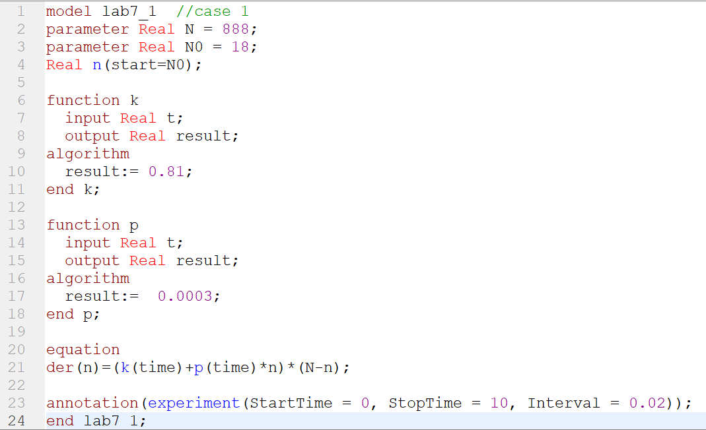{width=50%}

## Построение модели  на языке OpenModelica. Случай 1

2. Получаем следующий результат:

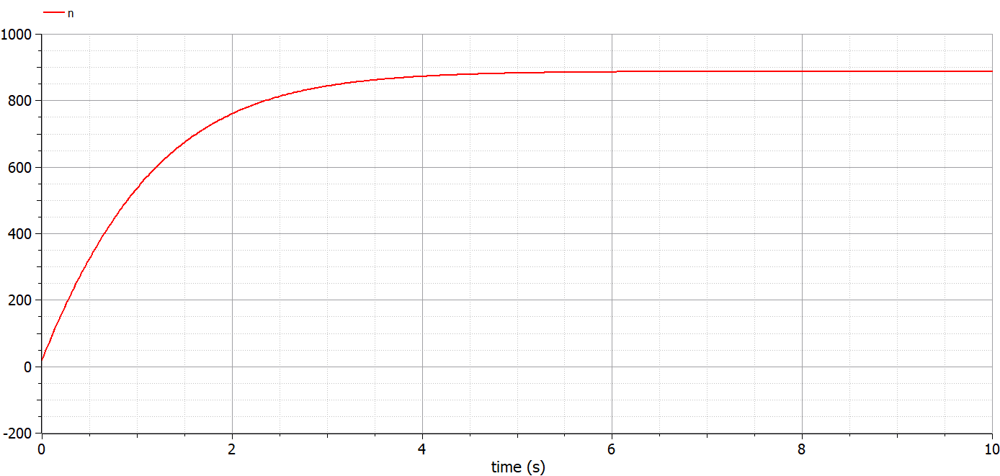{#fig:01 width=50%}

# Построение модели эпидемии на языке Julia. Случай 1

## Построение модели на языке Julia. Случай 1 
4. Листинг программы на Julia

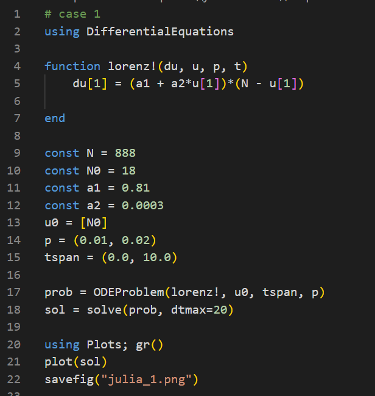{width=30%}

## Построение модели на языке Julia. Случай 1 

5. Результат на Julia выглядит следующим образом

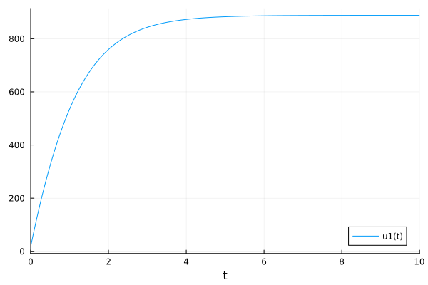{width=50%}

# Построение модели эпидемии. Случай 2

## Построение модели на языке OpenModelica. Случай 2
6. Листинг программы в OpenModelica

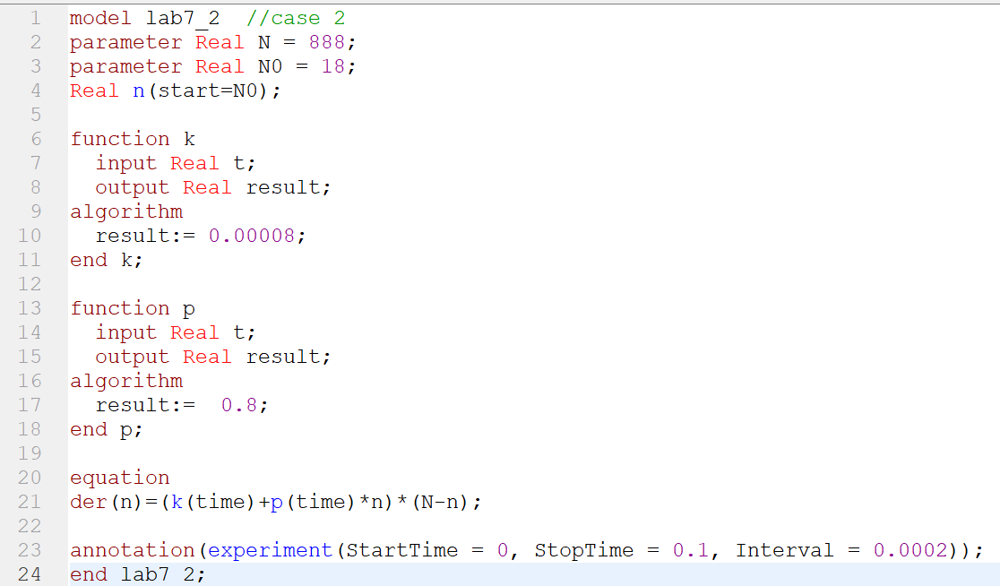{width=50%}

## Построение модели  на языке OpenModelica. Случай 2

7. Получаем следующий результат:

{#fig:01 width=50%}

# Построение модели эпидемии на языке Julia. Случай 2

## Построение модели на языке Julia. Случай 2 
8. Листинг программы на Julia

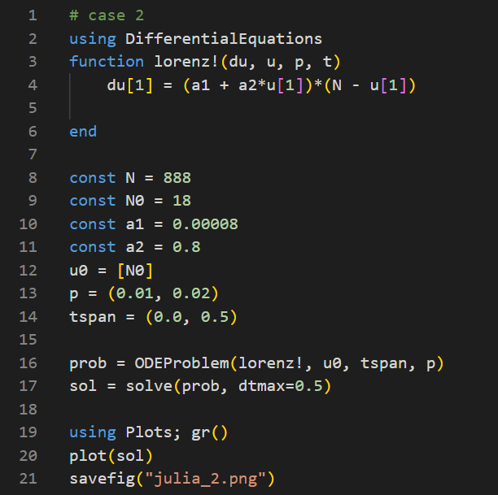{width=40%}

## Построение модели на языке Julia. Случай 2 

9. Результат на Julia выглядит следующим образом

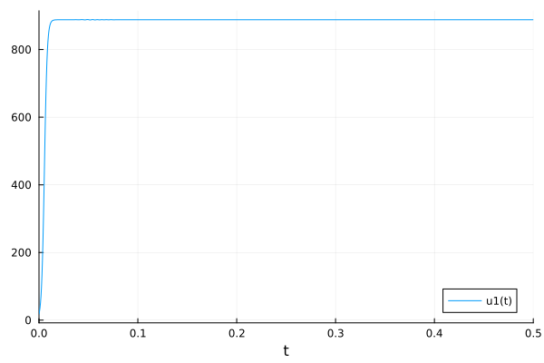{width=50%}

# Построение модели эпидемии. Случай 3

## Построение модели на языке OpenModelica. Случай 3
10. Листинг программы в OpenModelica

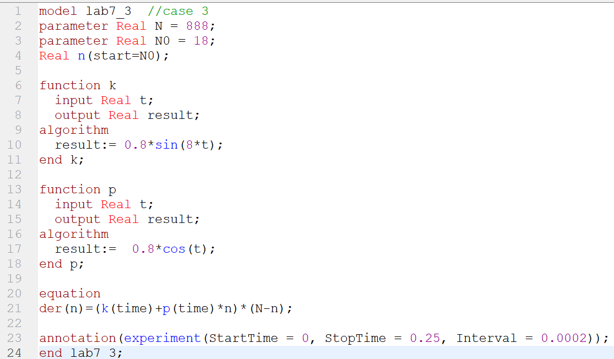{width=50%}

## Построение модели  на языке OpenModelica. Случай 3

11. Получаем следующий результат:

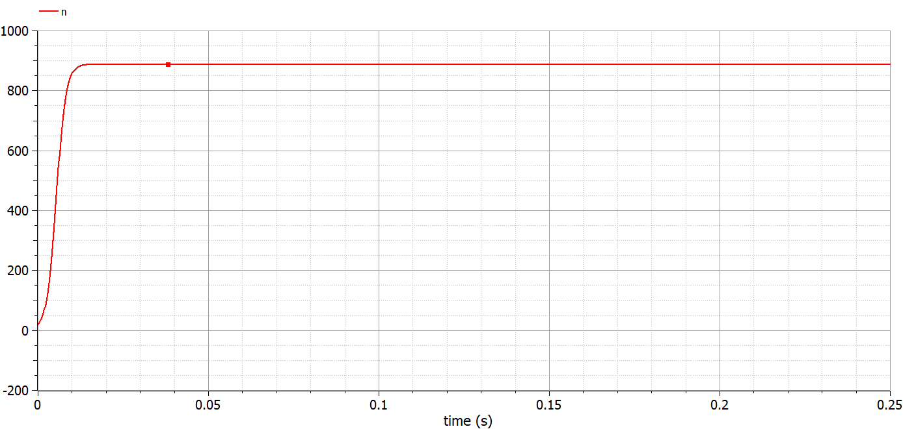{#fig:01 width=50%}

# Построение модели эпидемии на языке Julia. Случай 3

## Построение модели на языке Julia. Случай 3 
12. Листинг программы на Julia

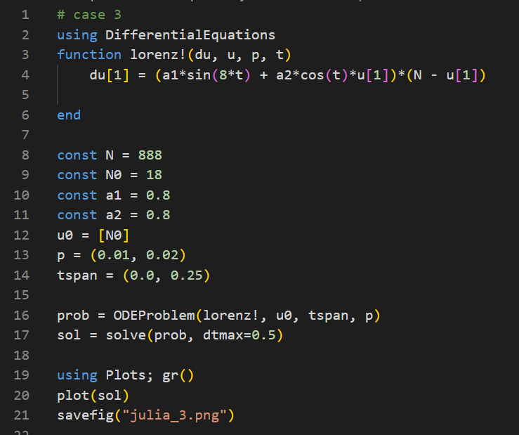{width=40%}

## Построение модели на языке Julia. Случай 3 

13. Результат на Julia выглядит следующим образом

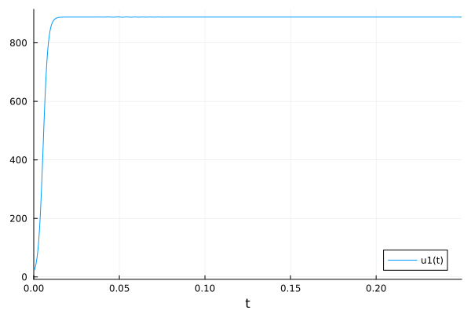{width=50%}

# Результаты
## Вывод

В ходе лабораторной работы нам удалось построить график распространения рекламы, математическая модель которой описывается уравнением, заданным в варианте №7.

