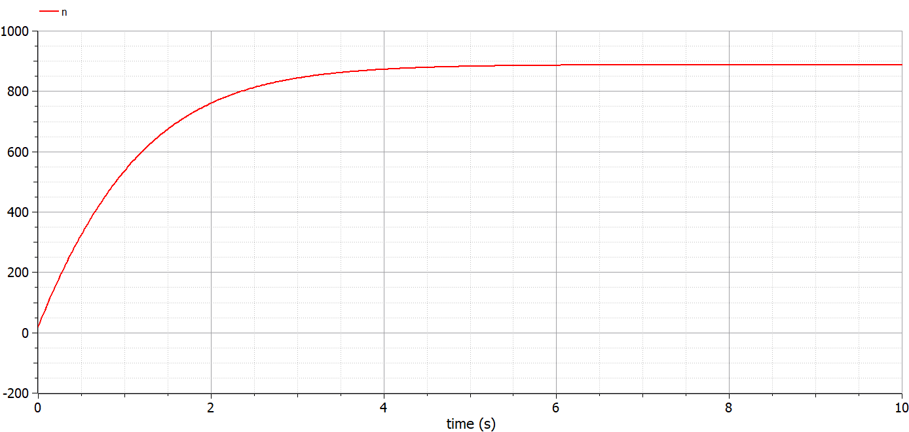
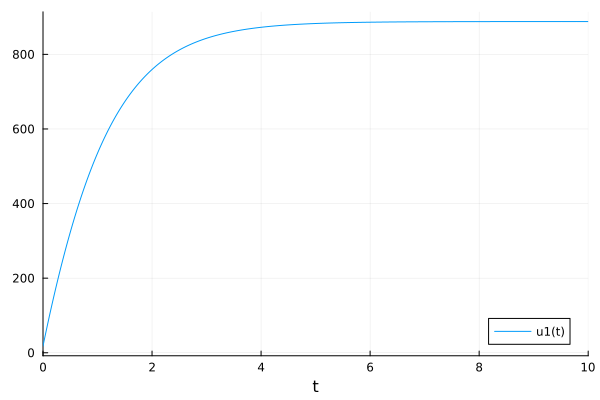
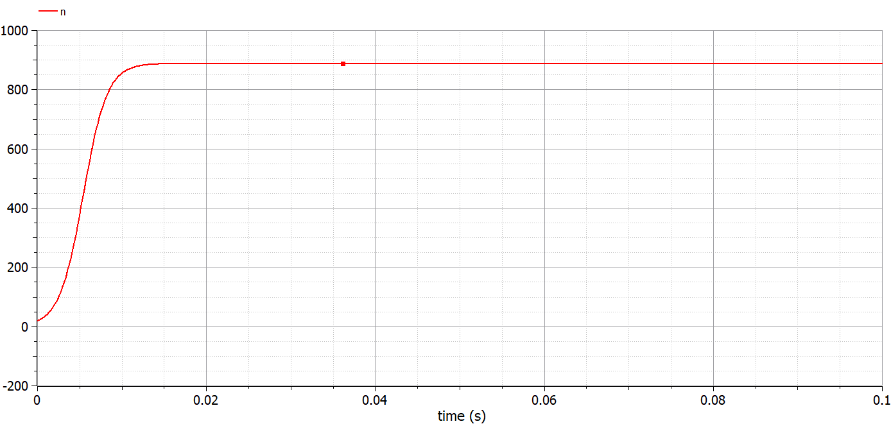
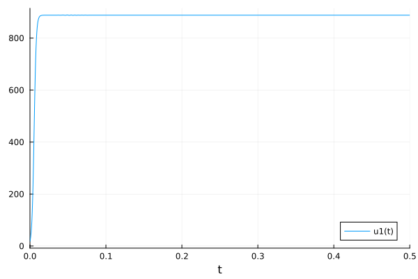
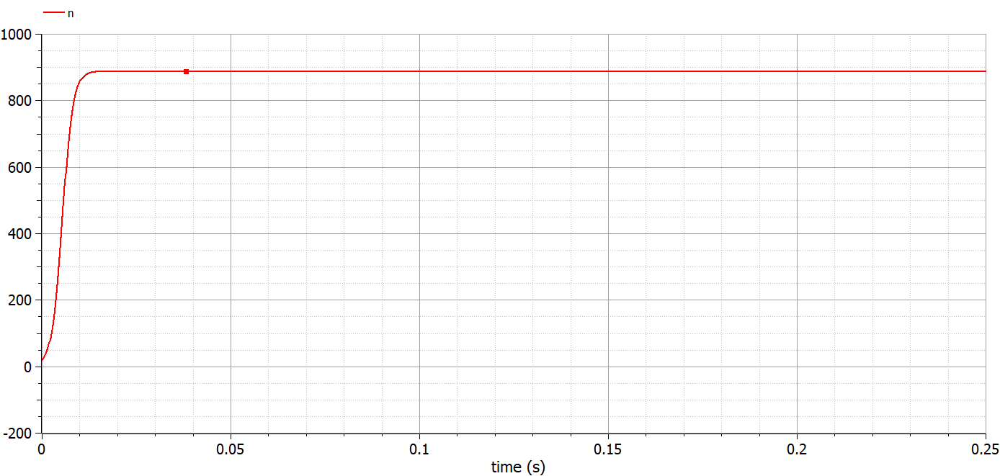
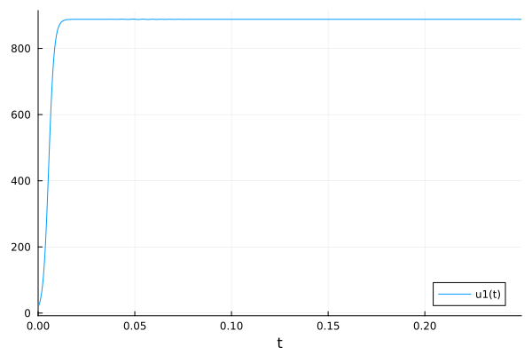

---
# Front matter
lang: ru-RU
title: "Отчёт по лабораторной работе №7"
subtitle: "Эффективность рекламы"
author: "Голощапова Ирина Борисовна"

# Formatting
toc-title: "Содержание"
toc: true # Table of contents
toc_depth: 2
lof: true # List of figures
lot: true # List of tables
fontsize: 12pt
linestretch: 1.5
papersize: a4paper
documentclass: scrreprt
polyglossia-lang: russian
polyglossia-otherlangs: english
mainfont: PT Serif
romanfont: PT Serif
sansfont: PT Sans
monofont: PT Mono
mainfontoptions: Ligatures=TeX
romanfontoptions: Ligatures=TeX
sansfontoptions: Ligatures=TeX,Scale=MatchLowercase
monofontoptions: Scale=MatchLowercase
indent: true
pdf-engine: lualatex
header-includes:
  - \linepenalty=10 # the penalty added to the badness of each line within a paragraph (no associated penalty node) Increasing the value makes tex try to have fewer lines in the paragraph.
  - \interlinepenalty=0 # value of the penalty (node) added after each line of a paragraph.
  - \hyphenpenalty=50 # the penalty for line breaking at an automatically inserted hyphen
  - \exhyphenpenalty=50 # the penalty for line breaking at an explicit hyphen
  - \binoppenalty=700 # the penalty for breaking a line at a binary operator
  - \relpenalty=500 # the penalty for breaking a line at a relation
  - \clubpenalty=150 # extra penalty for breaking after first line of a paragraph
  - \widowpenalty=150 # extra penalty for breaking before last line of a paragraph
  - \displaywidowpenalty=50 # extra penalty for breaking before last line before a display math
  - \brokenpenalty=100 # extra penalty for page breaking after a hyphenated line
  - \predisplaypenalty=10000 # penalty for breaking before a display
  - \postdisplaypenalty=0 # penalty for breaking after a display
  - \floatingpenalty = 20000 # penalty for splitting an insertion (can only be split footnote in standard LaTeX)
  - \raggedbottom # or \flushbottom
  - \usepackage{float} # keep figures where there are in the text
  - \floatplacement{figure}{H} # keep figures where there are in the text
---

# Цели и задачи лабораторной работы

## Цель работы

Рассмотреть модель рекламной компании.

## Задачи работы

Согласно своему варианту (вариант №7) построить график распространения рекламы, математическая модель которой описывается уравнением, данным в методическом материале.

# Теоретическая справка

## Модель рекламной компании

Организуется рекламная кампания нового товара или услуги. Необходимо, чтобы прибыль будущих продаж с избытком покрывала издержки на рекламу.
Вначале расходы могут превышать прибыль, поскольку лишь малая часть потенциальных покупателей будет информирована о новинке. Затем, при увеличении числа продаж, возрастает и прибыль, и, наконец, наступит момент, когда рынок насытиться, и рекламировать товар станет бесполезным.

Предположим, что торговыми учреждениями реализуется некоторая
продукция, о которой в момент времени $t$ из числа потенциальных покупателей $N$ знает лишь $n$ покупателей. Для ускорения сбыта продукции запускается реклама
по радио, телевидению и других средств массовой информации. 

После запуска рекламной кампании информация о продукции начнет распространяться среди потенциальных покупателей путем общения друг с другом. Таким образом, после запуска рекламных объявлений скорость изменения числа знающих о продукции
людей пропорциональна как числу знающих о товаре покупателей, так и числу покупателей о нем не знающих.

Модель рекламной кампании описывается следующими величинами.
Считаем, что $\frac{dn}{dt}$ - скорость изменения со временем числа потребителей, узнавших о товаре и готовых его купить,
$t$ - время, прошедшее с начала рекламной кампании,
$n(t)$ - число уже информированных клиентов. Эта величина
пропорциональна числу покупателей, еще не знающих о нем, это описывается следующим образом:
$\alpha_1 (t)(N-n(t))$ , где
$N$ - общее число потенциальных платежеспособных покупателей,

$\alpha_1(t)>0$ - характеризует интенсивность рекламной кампании (зависит от затрат на рекламу в данный момент времени).

Помимо этого, узнавшие о товаре потребители также распространяют полученную
информацию среди потенциальных покупателей, не знающих о нем (в этом случае работает т.н. сарафанное радио). Этот вклад в рекламу описывается величиной

$\alpha_2 n(t)(N-n(t))$, эта величина увеличивается с увеличением потребителей
узнавших о товаре. Математическая модель распространения рекламы описывается уравнением:

1. 
    \begin{equation}
        \frac{dn}{dt} = (\alpha_1(t)+ \alpha_2(t) n(t))*(N - n(t))
    \end{equation}

# Условие задачи (вариант №7)

Постройте график распространения рекламы, математическая модель которой описывается следующим уравнением:

1. 
    \begin{equation}
        \frac{dn}{dt} = (0.81+0.0003 n(t))*(N - n(t))
    \end{equation}
   

2. 
    \begin{equation}
        \frac{dn}{dt} = (0.00008+0.8 n(t))*(N - n(t))
    \end{equation}
   

3. 
    \begin{equation}
        \frac{dn}{dt} = (0.8sin(8t)+0.8cos(t) n(t))*(N - n(t))
    \end{equation}
   

При этом объем аудитории $N = 888$, в начальный момент о товарезнает 18 человек. Для случая 2 определите в какой момент времени скорость распространения рекламы будет иметь максимальное значение.

# Выполнение лабораторной работы

## Реализация в OpenModelica. Случай 1 

Для начала реализуем решение данной задачи в OpenModelica:

Листинг программы для первого случая (уравнение (2)) 

        model lab7_1  //case 1

        parameter Real N = 888;
        parameter Real N0 = 18;
        Real n(start=N0);

        function k
        input Real t;
        output Real result;
        algorithm
        result:= 0.81; 
        end k;

        function p
        input Real t;
        output Real result;
        algorithm
        result:=  0.0003; 
        end p;

        equation
        der(n)=(k(time)+p(time)*n)*(N-n);

        annotation(experiment(StartTime = 0, StopTime = 10, Interval = 0.02));
        end lab7_1;

В результате получим следующий график (рис. @fig:01):

{#fig:01 width=60%}

## Реализация на Julia. Случай 1 

Листинг программы на Julia:

        # case 1
        using DifferentialEquations

        function lorenz!(du, u, p, t)
            du[1] = (a1 + a2*u[1])*(N - u[1])

        end

        const N = 888
        const N0 = 18
        const a1 = 0.81
        const a2 = 0.0003
        u0 = [N0]
        p = (0.01, 0.02)
        tspan = (0.0, 10.0)

        prob = ODEProblem(lorenz!, u0, tspan, p)
        sol = solve(prob, dtmax=20)

        using Plots; gr()
        plot(sol)
        savefig("julia_1.png")

        

В результате получим следующий график, на котором виден характер поведения функции (рис. @fig:02):

{#fig:02 width=60%}

## Реализация в OpenModelica. Случай 2 

Рассмотрим случай №2 (уравнение (3))

Листинг программы для второго случая:

        model lab7_2  //case 2
        parameter Real N = 888;
        parameter Real N0 = 18;
        Real n(start=N0);

        function k
        input Real t;
        output Real result;
        algorithm
        result:= 0.00008; 
        end k;

        function p
        input Real t;
        output Real result;
        algorithm
        result:=  0.8; 
        end p;

        equation
        der(n)=(k(time)+p(time)*n)*(N-n);

        annotation(experiment(StartTime = 0, StopTime = 0.1, Interval = 0.0002));
        end lab7_2;

Получим следующее решение (рис. @fig:03)

{#fig:03 width=60%}

## Реализация на Julia. Случай 2

Листинг программы:

        # case 2
        using DifferentialEquations
        function lorenz!(du, u, p, t)
            du[1] = (a1 + a2*u[1])*(N - u[1])

        end

        const N = 888
        const N0 = 18
        const a1 = 0.00008
        const a2 = 0.8
        u0 = [N0]
        p = (0.01, 0.02)
        tspan = (0.0, 0.5)

        prob = ODEProblem(lorenz!, u0, tspan, p)
        sol = solve(prob, dtmax=0.5)

        using Plots; gr()
        plot(sol)
        savefig("julia_2.png")

В результате получим следующий график (рис. @fig:04):

{#fig:04 width=60%}

## Реализация в OpenModelica. Случай 3 

Рассмотрим случай №3 (уравнение (4))

Листинг программы для третьего случая:

        model lab7_3  //case 3
        parameter Real N = 888;
        parameter Real N0 = 18;
        Real n(start=N0);

        function k
        input Real t;
        output Real result;
        algorithm
        result:= 0.8*sin(8*t); 
        end k;

        function p
        input Real t;
        output Real result;
        algorithm
        result:=  0.8*cos(t); 
        end p;

        equation
        der(n)=(k(time)+p(time)*n)*(N-n);

        annotation(experiment(StartTime = 0, StopTime = 0.25, Interval = 0.0002));
        end lab7_3;

Получим следующее решение (рис. @fig:05)

{#fig:05 width=60%}

## Реализация на Julia. Случай 3

Листинг программы:

        # case 3
        using DifferentialEquations
        function lorenz!(du, u, p, t)
            du[1] = (a1*sin(8*t) + a2*cos(t)*u[1])*(N - u[1])

        end

        const N = 888
        const N0 = 18
        const a1 = 0.8
        const a2 = 0.8
        u0 = [N0]
        p = (0.01, 0.02)
        tspan = (0.0, 0.25)

        prob = ODEProblem(lorenz!, u0, tspan, p)
        sol = solve(prob, dtmax=0.5)

        using Plots; gr()
        plot(sol)
        savefig("julia_3.png")

В результате получим следующий график (рис. @fig:06):

{#fig:06 width=60%}

# Выводы

В ходе лабораторной работы нам удалось построить график распространения рекламы, математическая модель которой описывается уравнением, данным в варианте №7.

# Библиография
1. [Git - система контроля версий](https://github.com/)

2. [Дифференциальные уравнения](https://ru.wikipedia.org/wiki/Дифференциальное_уравнение)

3. [Язык программирования - Julia](https://julialang.org/)

4. [Решение ДУ на языке программирование Julia](https://nextjournal.com/sosiris-de/ode-diffeq)

5. [Работа с OpenModelica](https://openmodelica.org/download/download-linux/)

