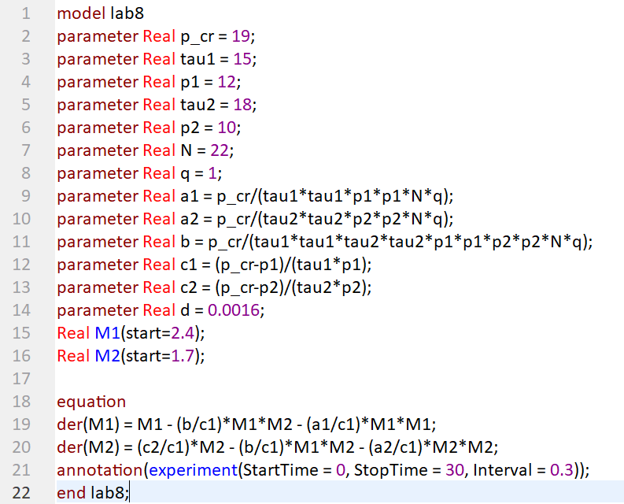
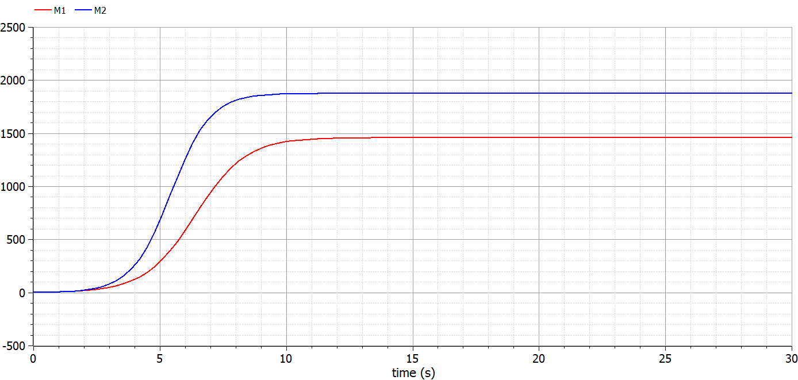
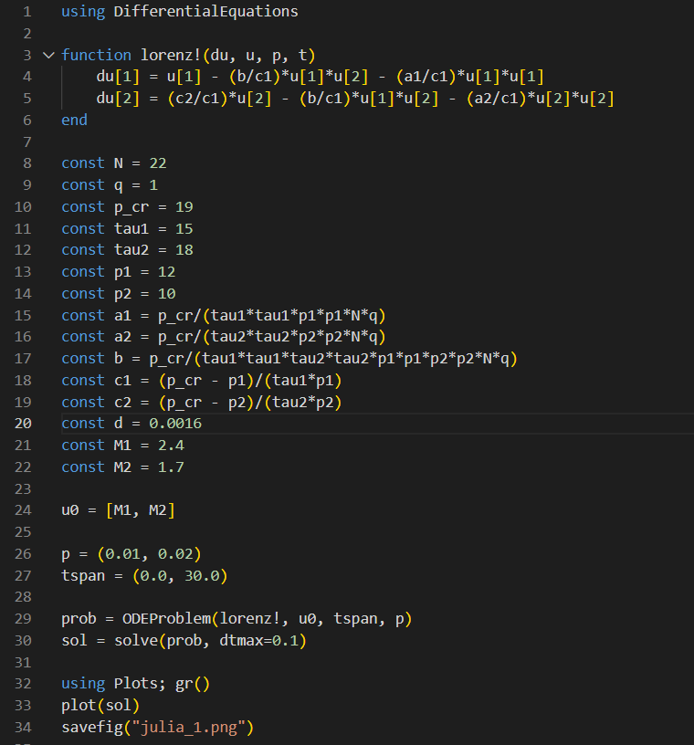
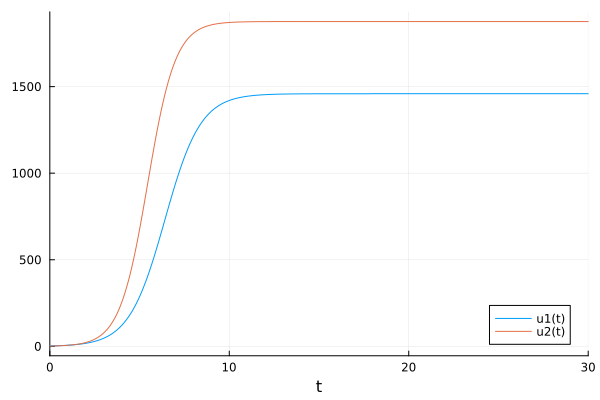
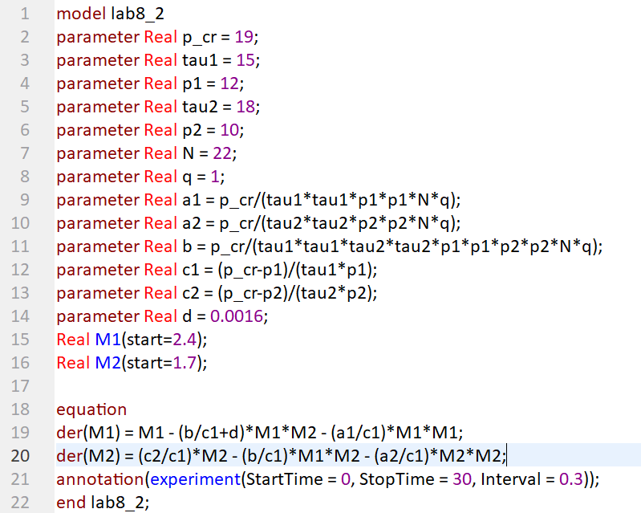
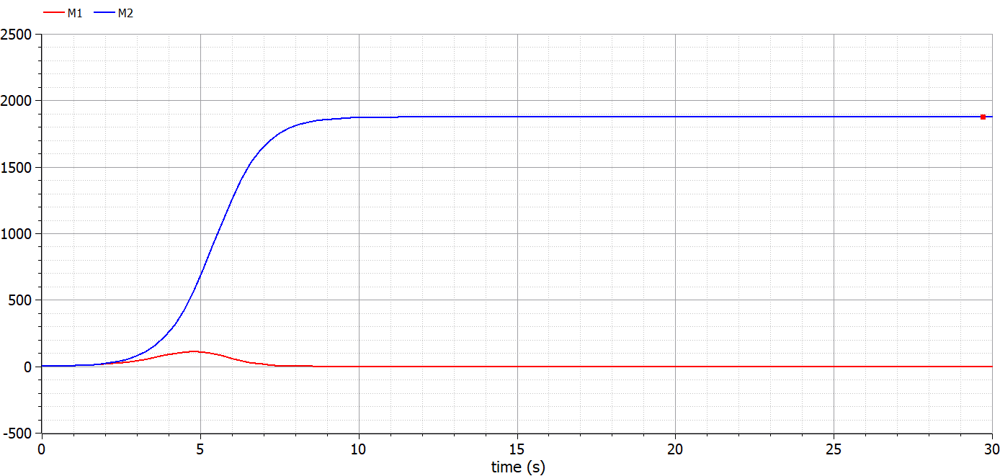
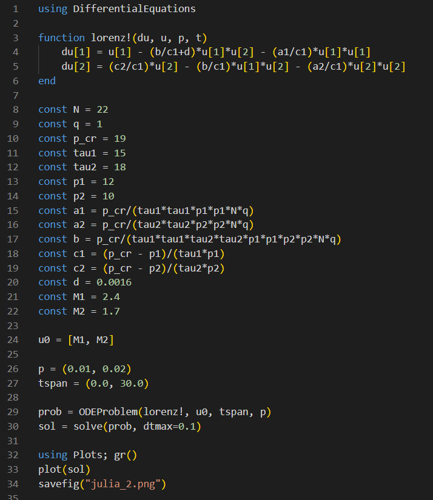
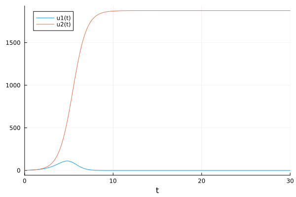

---
## Front matter
lang: ru-RU
title: Лабораторная работа №8
subtitle: "Модель конкуренции двух фирм"
author:
  - Голощапова Ирина Борисовна
institute:
  - Российский университет дружбы народов, Москва, Россия
date: 31 марта 2023

## i18n babel
babel-lang: russian
babel-otherlangs: english

## Fonts
mainfont: PT Serif
romanfont: PT Serif
sansfont: PT Sans
monofont: PT Mono
mainfontoptions: Ligatures=TeX
romanfontoptions: Ligatures=TeX
sansfontoptions: Ligatures=TeX,Scale=MatchLowercase
monofontoptions: Scale=MatchLowercase,Scale=0.9

## Formatting pdf
toc: false
toc-title: Содержание
slide_level: 2
aspectratio: 169
section-titles: true
theme: metropolis
header-includes:
 - \metroset{progressbar=frametitle,sectionpage=progressbar,numbering=fraction}
 - '\makeatletter'
 - '\beamer@ignorenonframefalse'
 - '\makeatother'
---

# Информация

## Докладчик

:::::::::::::: {.columns align=center}
::: {.column width="70%"}

  * Голощапова Ирина Борисовна
  * студентка уч. группы НФИбд-01-20
  * Российский университет дружбы народов
  * [1032201666@pfur.ru](mailto:1032201666@pfur.ru)
  * <https://github.com/ibgoloshchapowa>

:::
::: {.column width="30%"}

:::
::::::::::::::

# Вводная часть

## Актуальность

Экономическая сфера регулярно претерпевает сильные изменения:
создаются новые рабочие места, наблюдается рост производства в различных сферах промышленности, улучшаются технологии. Важной ее частью является мировая экономическая система, которая имеет сложную иерархическую структуру. Поэтому в данной работе будет рассматриваться вопрос
математического моделирования конкурентных взаимоотношений в мировой экономике. 

## Объект и предмет исследования

- Модель конкуренции двух фирм
- Язык программирования Julia
- Язык моделирования OpenModelica

## Цели и задачи

Рассмотреть и подробно изучить принцип построения модели конкуренции двух фирм.

Согласно своему варианту (вариант №7):

1. Построить графики изменения оборотных средств фирмы 1 и фирмы 2 без учета постоянных издержек и с веденной нормировкой для случая 1.

2. Построить графики изменения оборотных средств фирмы 1 и фирмы 2 без учета постоянных издержек и с веденной нормировкой для случая 2.

## Условие задачи. Вариант №7

## Случай 1

$$
    \begin{equation}
        \frac{dM_1}{d \theta} = M_1 - \frac{b}{c_1} M_1 M_2 - \frac{a_1}{c_1} M_1^2
    \end{equation}
$$

$$
    \begin{equation}
        \frac{dM_2}{d \theta} = \frac{c_2}{c_1}M_2 - \frac{b}{c_1}M_1 M_2 - \frac{a_2}{c_1} M_2^2
    \end{equation}
$$

1. Постройте графики изменения оборотных средств фирмы 1 и фирмы 2 без учета постоянных издержек и с веденной нормировкой для случая 1.

## Случай 2

$$
    \begin{equation}
        \frac{dM_1}{d \theta} = M_1 - (\frac{b}{c_1} + 0.0016) M_1 M_2 - \frac{a_1}{c_1} M_1^2
    \end{equation}
$$

$$
    \begin{equation}
        \frac{dM_2}{d \theta} = \frac{c_2}{c_1}M_2 - \frac{b}{c_1}M_1 M_2 - \frac{a_2}{c_1} M_2^2
    \end{equation}
$$

2. Постройте графики изменения оборотных средств фирмы 1 и фирмы 2 без учета постоянных издержек и с веденной нормировкой для случая 2.

# Выполнение работы
# Построение модели рекламной компании. Случай 1

## Построение модели на языке OpenModelica. Случай 1
1. Листинг программы в OpenModelica

{width=30%}

## Построение модели  на языке OpenModelica. Случай 1

2. Получаем следующий результат:

{#fig:01 width=50%}

# Построение модели эпидемии на языке Julia. Случай 1

## Построение модели на языке Julia. Случай 1 
4. Листинг программы на Julia

{width=30%}

## Построение модели на языке Julia. Случай 1 

5. Результат на Julia выглядит следующим образом

{width=50%}

# Построение модели эпидемии. Случай 2

## Построение модели на языке OpenModelica. Случай 2
6. Листинг программы в OpenModelica

{width=30%}

## Построение модели  на языке OpenModelica. Случай 2

7. Получаем следующий результат:

{#fig:01 width=50%}

# Построение модели эпидемии на языке Julia. Случай 2

## Построение модели на языке Julia. Случай 2 
8. Листинг программы на Julia

{width=30%}

## Построение модели на языке Julia. Случай 2 

9. Результат на Julia выглядит следующим образом

{width=50%}

# Результаты
## Вывод

В ходе лабораторной работы нам удалось рассмотреть и подброно изучить принцип построения модели конкуренции двух фирм, а также построить графики изменения оборотных средств фирмы 1 и фирмы 2 без учета постоянных издержек и с веденной нормировкой для случая 1 и случая 2.

