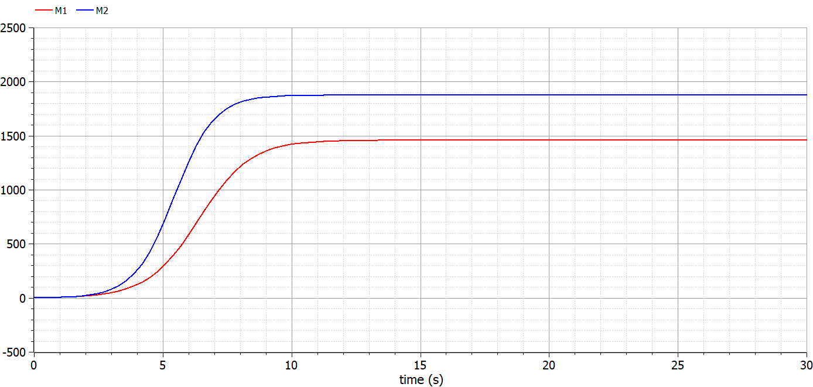
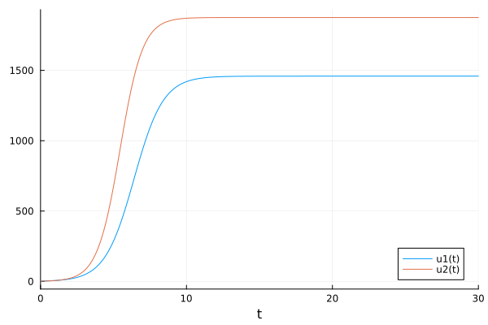
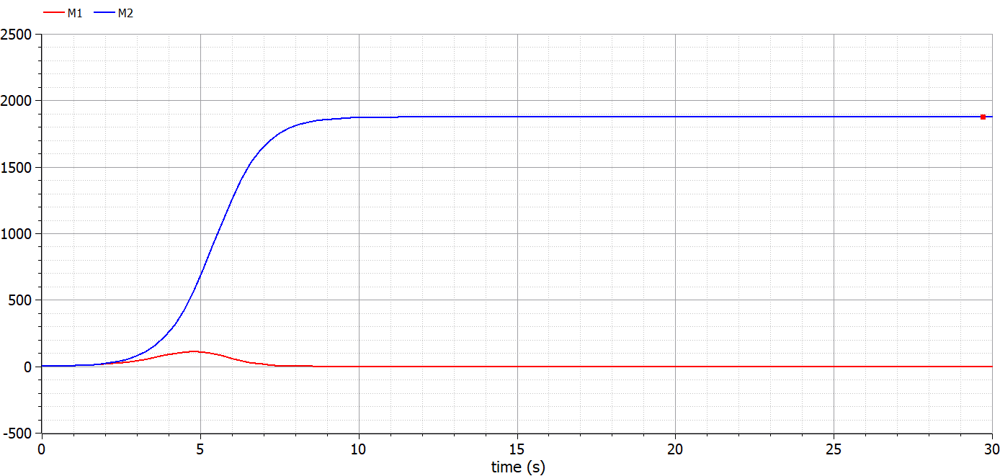
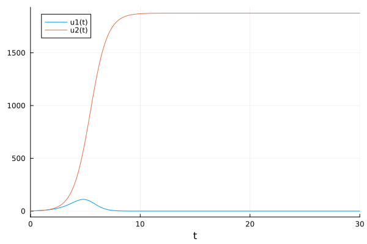

---
# Front matter
lang: ru-RU
title: "Отчёт по лабораторной работе №8"
subtitle: "Модель конкуренции двух фирм"
author: "Голощапова Ирина Борисовна"

# Formatting
toc-title: "Содержание"
toc: true # Table of contents
toc_depth: 2
lof: true # List of figures
lot: true # List of tables
fontsize: 12pt
linestretch: 1.5
papersize: a4paper
documentclass: scrreprt
polyglossia-lang: russian
polyglossia-otherlangs: english
mainfont: PT Serif
romanfont: PT Serif
sansfont: PT Sans
monofont: PT Mono
mainfontoptions: Ligatures=TeX
romanfontoptions: Ligatures=TeX
sansfontoptions: Ligatures=TeX,Scale=MatchLowercase
monofontoptions: Scale=MatchLowercase
indent: true
pdf-engine: lualatex
header-includes:
  - \linepenalty=10 # the penalty added to the badness of each line within a paragraph (no associated penalty node) Increasing the value makes tex try to have fewer lines in the paragraph.
  - \interlinepenalty=0 # value of the penalty (node) added after each line of a paragraph.
  - \hyphenpenalty=50 # the penalty for line breaking at an automatically inserted hyphen
  - \exhyphenpenalty=50 # the penalty for line breaking at an explicit hyphen
  - \binoppenalty=700 # the penalty for breaking a line at a binary operator
  - \relpenalty=500 # the penalty for breaking a line at a relation
  - \clubpenalty=150 # extra penalty for breaking after first line of a paragraph
  - \widowpenalty=150 # extra penalty for breaking before last line of a paragraph
  - \displaywidowpenalty=50 # extra penalty for breaking before last line before a display math
  - \brokenpenalty=100 # extra penalty for page breaking after a hyphenated line
  - \predisplaypenalty=10000 # penalty for breaking before a display
  - \postdisplaypenalty=0 # penalty for breaking after a display
  - \floatingpenalty = 20000 # penalty for splitting an insertion (can only be split footnote in standard LaTeX)
  - \raggedbottom # or \flushbottom
  - \usepackage{float} # keep figures where there are in the text
  - \floatplacement{figure}{H} # keep figures where there are in the text
---

# Цели и задачи лабораторной работы

## Цель работы

Рассмотреть и подброно изучить принцип построения модели конкуренции двух фирм.

## Задачи работы

Согласно своему варианту (вариант №7):

1. Построить графики изменения оборотных средств фирмы 1 и фирмы 2 без учета постоянных издержек и с веденной нормировкой для случая 1.

2. Построить графики изменения оборотных средств фирмы 1 и фирмы 2 без учета постоянных издержек и с веденной нормировкой для случая 2.

 

# Теоретическая справка

## Модель конкуренции двух фирм

Для построения модели конкуренции хотя бы двух фирм необходимо рассмотреть модель одной фирмы. Вначале рассмотрим модель фирмы, производящей продукт долговременного пользования, когда цена его определяется
балансом спроса и предложения. Примем, что этот продукт занимает определенную нишу рынка и конкуренты в ней отсутствуют.

**Обозначим:**

$N$ – число потребителей производимого продукта.

$S$ – доходы потребителей данного продукта. Считаем, что доходы всех потребителей одинаковы. Это предположение справедливо, если речь идет об одной рыночной нише, т.е. производимый продукт ориентирован на определенный
слой населения.

$M$ – оборотные средства предприятия

$τ$ – длительность производственного цикла

$p$ – рыночная цена товара

$p̃$ – себестоимость продукта, то есть переменные издержки на производство единицы продукции.

$δ$ – доля оборотных средств, идущая на покрытие переменных издержек.

$κ$ – постоянные издержки, которые не зависят от количества выпускаемой продукции.

$Q(\frac{S}{p})$ – функция спроса, зависящая от отношения дохода $S$ к цене $p$. Она равна количеству продукта, потребляемого одним потребителем в единицу времени.

Функцию спроса товаров долговременного использования часто
представляют в простейшей форме:

$$
    \begin{equation}
        Q = q - k \frac{p}{S} = q(1- \frac{p}{p_cr})
    \end{equation}
$$

где $q$ – максимальная потребность одного человека в продукте в единицу времени. Эта функция падает с ростом цены и при $p = p_cr$ (критическая стоимость продукта) потребители отказываются от приобретения товара. Величина $p_cr = \frac{Sq}{k}$.
Параметр $k$ – мера эластичности функции спроса по цене. Таким образом, функция спроса в форме (1) является пороговой (то есть, $Q(S/p) = 0$ при $p ≥ p_cr$) и обладает свойствами насыщения.

Уравнения динамики оборотных средств можно записать в виде:

$$
    \begin{equation}
        \frac{dM}{dt} = -\frac{M \delta}{\tau} + NQp - k = -\frac{M \delta}{\tau} + Nq(1- \frac{p}{p_cr})p - k
    \end{equation}
$$

Уравнение для рыночной цены p представим в виде:

$$
    \begin{equation}
        \frac{dp}{dt} = \gamma(-\frac{M\delta}{\tau p̃} + Nq(1- \frac{p}{p_cr}))
    \end{equation}
$$

Первый член соответствует количеству поставляемого на рынок товара (то есть, предложению), а второй член – спросу.

Параметр $γ$ зависит от скорости оборота товаров на рынке. Как правило, время торгового оборота существенно меньше времени производственного цикла $τ$.
При заданном $M$ уравнение (3) описывает быстрое стремление цены к равновесному значению цены, которое устойчиво.

В этом случае уравнение (3) можно заменить алгебраическим соотношением:

$$
    \begin{equation}
        -\frac{M \delta}{\tau p̃} + Nq(1 - \frac{p}{p_cr}) = 0
    \end{equation}
$$

Из (4) следует, что равновесное значение цены $p$ равно

$$
    \begin{equation}
        p = p_cr(1- \frac{M \delta}{\tau p̃ Nq}) 
    \end{equation}
$$

Уравнение (2) с учетом (5) приобретает вид 

$$
    \begin{equation}
        \frac{dM}{dt} = M\frac{\delta}{\tau}(\frac{p_cr}{p̃} - 1) - M^2(\frac{\delta}{\tau p̃})^2 *\frac{p_cr}{Nq} - k
    \end{equation}
$$

Уравнение (6) имеет два стационарных решения, соответствующих условию $dM/dt = 0$:

$$
    \begin{equation}
        M_1,_2 = \frac{1}{2}a_-^+ \sqrt{\frac{a^2}{4} - b}
    \end{equation}
$$

где   

$$
    \begin{equation}
        a = Nq(1 - \frac{p̃}{p_cr})p̃ \frac{\tau}{\delta}, 
        \
        b = kNq \frac{(\tau p̃)^2}{p_cr \delta^2}
    \end{equation}
$$

Из (7) следует, что при больших постоянных издержках (в случае $a^2 < 4b$) стационарных состояний нет. Это означает, что в этих условиях фирма не может
функционировать стабильно, то есть, терпит банкротство. Однако, как правило, постоянные затраты малы по сравнению с переменными (то есть, $b<<a^2$) и играют роль, только в случае, когда оборотные средства малы. При $b<<a$ стационарные значения $M$ равны

$$
    \begin{equation}
        M_+ = Nq \frac{\tau}{p_cr}p̃ ,  
        \
        M_- = kp̃ \frac{\tau}{\delta (p_cr - p̃)}
    \end{equation}
$$

Первое состояние $M_+$ устойчиво и соответствует стабильному функционированию предприятия. Второе состояние $M_-$ неустойчиво, так, что при $M < M_-$
оборотные средства падают ($dM/dt < 0$), то есть, фирма идет к банкротству. По смыслу $M_-$
соответствует начальному капиталу, необходимому
для входа в рынок.

В обсуждаемой модели параметр $δ$ всюду входит в сочетании с $τ$. Это значит, что уменьшение доли оборотных средств, вкладываемых в производство,
эквивалентно удлинению производственного цикла. Поэтому мы в дальнейшем положим: $δ = 1$, а параметр $τ$ будем считать временем цикла, с учётом сказанного.

# Условие задачи (вариант №7)

### Случай 1. 
Рассмотрим две фирмы, производящие взаимозаменяемые товары одинакового качества и находящиеся в одной рыночной нише. Считаем, что в рамках
нашей модели конкурентная борьба ведётся только рыночными методами. То есть, конкуренты могут влиять на противника путем изменения параметров своего
производства: себестоимость, время цикла, но не могут прямо вмешиваться в ситуацию на рынке («назначать» цену или влиять на потребителей каким-либо иным способом.) Будем считать, что постоянные издержки пренебрежимо малы, и в модели учитывать не будем. В этом случае динамика изменения объемов продаж фирмы 1 и фирмы 2 описывается следующей системой уравнений:

$$
    \begin{equation}
        \frac{dM_1}{d \theta} = M_1 - \frac{b}{c_1} M_1 M_2 - \frac{a_1}{c_1} M_1^2
    \end{equation}
$$

$$
    \begin{equation}
        \frac{dM_2}{d \theta} = \frac{c_2}{c_1}M_2 - \frac{b}{c_1}M_1 M_2 - \frac{a_2}{c_1} M_2^2
    \end{equation}
$$

где 

$a_1 = \frac{p_cr}{\tau_1^2 p̃_1^2 Nq}$,  
$a_2 = \frac{p_cr}{\tau_2^2 p̃_2^2 Nq}$, 
$b = \frac{p_cr}{\tau_1^2 p̃_1^2 \tau_2^2 p̃_2^2 Nq}$, 
$c_1 = \frac{p_cr - p̃_1}{\tau_1 p̃_1}$
$c_2 = \frac{p_cr - p̃_2}{\tau_2 p̃_2}$.

Также введена нормировка $t = c_1 \theta$

### Случай 2. 

Рассмотрим модель, когда, помимо экономического фактора влияния (изменение себестоимости, производственного цикла, использование
кредита и т.п.), используются еще и социально-психологические факторы –
формирование общественного предпочтения одного товара другому, не зависимо от их качества и цены. В этом случае взаимодействие двух фирм будет зависеть друг от друга, соответственно коэффициент перед $M_1 M_2$ будет отличаться. Пусть в рамках рассматриваемой модели динамика изменения объемов продаж фирмы 1 и фирмы 2 описывается следующей системой уравнений:

$$
    \begin{equation}
        \frac{dM_1}{d \theta} = M_1 - (\frac{b}{c_1} + 0.0016) M_1 M_2 - \frac{a_1}{c_1} M_1^2
    \end{equation}
$$

$$
    \begin{equation}
        \frac{dM_2}{d \theta} = \frac{c_2}{c_1}M_2 - \frac{b}{c_1}M_1 M_2 - \frac{a_2}{c_1} M_2^2
    \end{equation}
$$

Для обоих случаев рассмотрим задачу со следующими начальными условиями:

$M_0^1 = 2.4$

$M_0^2 = 1.7$

$p_cr = 19$, $N = 22$, $q = 1$

и параметрами: $\tau_1 = 15$, $\tau_2 = 18$, $p̃_1 = 12$, $p̃_2 = 10$

**Замечание:** Значения $p_cr$, $p̃_1$, $p̃_2$, $N$ указаны в тысячах единиц, а значения $M_1, M_2$ - указаны в млн. единиц.

**Обозначения:**

$N$ – число потребителей производимого продукта.

$\tau$ – длительность производственного цикла

$p$ – рыночная цена товара

$p̃$ – себестоимость продукта, то есть переменные издержки на производство единицы
продукции.

$q$ – максимальная потребность одного человека в продукте в единицу времени

$\theta = \frac{t}{c_1}$ - безразмерное время.

### Задание:

1. Постройте графики изменения оборотных средств фирмы 1 и фирмы 2 без учета постоянных издержек и с веденной нормировкой для случая 1.

2. Постройте графики изменения оборотных средств фирмы 1 и фирмы 2 без учета постоянных издержек и с веденной нормировкой для случая 2.

# Выполнение лабораторной работы

## Реализация в OpenModelica. Случай 1 

Для начала реализуем решение данной задачи в OpenModelica:

Листинг программы для первого случая 

        model lab8
        parameter Real p_cr = 19;
        parameter Real tau1 = 15;
        parameter Real p1 = 12;
        parameter Real tau2 = 18;
        parameter Real p2 = 10; 
        parameter Real N = 22; 
        parameter Real q = 1; 
        parameter Real a1 = p_cr/(tau1*tau1*p1*p1*N*q);
        parameter Real a2 = p_cr/(tau2*tau2*p2*p2*N*q);
        parameter Real b = p_cr/(tau1*tau1*tau2*tau2*p1*p1*p2*p2*N*q);
        parameter Real c1 = (p_cr-p1)/(tau1*p1);
        parameter Real c2 = (p_cr-p2)/(tau2*p2);
        parameter Real d = 0.0016;

        Real M1(start=2.4);
        Real M2(start=1.7);

        equation
        der(M1) = M1 - (b/c1)*M1*M2 - (a1/c1)*M1*M1;
        der(M2) = (c2/c1)*M2 - (b/c1)*M1*M2 - (a2/c1)*M2*M2;

        annotation(experiment(StartTime = 0, StopTime = 30, Interval = 0.3));  
        end lab8;
     

В результате получим следующий график, на котором видно, что фирма 2 лидирует по продажам. (рис. @fig:01):

{#fig:01 width=60%}

## Реализация на Julia. Случай 1 

Теперь реализуем ту же задачу на Julia.

Листинг программы на Julia:

        using DifferentialEquations

        function lorenz!(du, u, p, t)
            du[1] = u[1] - (b/c1)*u[1]*u[2] - (a1/c1)*u[1]*u[1]
            du[2] = (c2/c1)*u[2] - (b/c1)*u[1]*u[2] - (a2/c1)*u[2]*u[2]
        end

        const N = 22
        const q = 1
        const p_cr = 19
        const tau1 = 15
        const tau2 = 18
        const p1 = 12
        const p2 = 10

        const a1 = p_cr/(tau1*tau1*p1*p1*N*q)
        const a2 = p_cr/(tau2*tau2*p2*p2*N*q)

        const b = p_cr/(tau1*tau1*tau2*tau2*p1*p1*p2*p2*N*q)
        const c1 = (p_cr - p1)/(tau1*p1)
        const c2 = (p_cr - p2)/(tau2*p2)
        const d = 0.0016

        const M1 = 2.4
        const M2 = 1.7 

        u0 = [M1, M2]

        p = (0.01, 0.02)
        tspan = (0.0, 30.0)

        prob = ODEProblem(lorenz!, u0, tspan, p)
        sol = solve(prob, dtmax=0.1)

        using Plots; gr()
        plot(sol)
        savefig("julia_1.png")

        

В результате получим следующий график, на котором виден характер поведения функций (рис. @fig:02):

{#fig:02 width=60%}

## Реализация в OpenModelica. Случай 2 

Рассмотрим случай №2. В листинге мы вносим изменения только в первое уравнение системы, добавляя параметр $d = 0.0016$.

Листинг программы для второго случая:

        model lab8_2
        parameter Real p_cr = 19;
        parameter Real tau1 = 15;
        parameter Real p1 = 12;
        parameter Real tau2 = 18;
        parameter Real p2 = 10; 
        parameter Real N = 22; 
        parameter Real q = 1; 
        parameter Real a1 = p_cr/(tau1*tau1*p1*p1*N*q);
        parameter Real a2 = p_cr/(tau2*tau2*p2*p2*N*q);
        parameter Real b = p_cr/(tau1*tau1*tau2*tau2*p1*p1*p2*p2*N*q);
        parameter Real c1 = (p_cr-p1)/(tau1*p1);
        parameter Real c2 = (p_cr-p2)/(tau2*p2);
        parameter Real d = 0.0016;

        Real M1(start=2.4);
        Real M2(start=1.7);

        equation
        der(M1) = M1 - (b/c1+d)*M1*M2 - (a1/c1)*M1*M1;
        der(M2) = (c2/c1)*M2 - (b/c1)*M1*M2 - (a2/c1)*M2*M2;

        annotation(experiment(StartTime = 0, StopTime = 30, Interval = 0.3));  
        end lab8_2;

Получим следующее решение, на котором видно, что фирма 1 потерпит банкротство через некоторое время. (рис. @fig:03)

{#fig:03 width=60%}

## Реализация на Julia. Случай 2

То же самое сделаем на Julia.

Листинг программы:

        using DifferentialEquations

        function lorenz!(du, u, p, t)
            du[1] = u[1] - (b/c1+d)*u[1]*u[2] - (a1/c1)*u[1]*u[1]
            du[2] = (c2/c1)*u[2] - (b/c1)*u[1]*u[2] - (a2/c1)*u[2]*u[2]
        end

        const N = 22
        const q = 1
        const p_cr = 19
        const tau1 = 15
        const tau2 = 18
        const p1 = 12
        const p2 = 10

        const a1 = p_cr/(tau1*tau1*p1*p1*N*q)
        const a2 = p_cr/(tau2*tau2*p2*p2*N*q)

        const b = p_cr/(tau1*tau1*tau2*tau2*p1*p1*p2*p2*N*q)
        const c1 = (p_cr - p1)/(tau1*p1)
        const c2 = (p_cr - p2)/(tau2*p2)
        const d = 0.0016

        const M1 = 2.4
        const M2 = 1.7 

        u0 = [M1, M2]

        p = (0.01, 0.02)
        tspan = (0.0, 30.0)

        prob = ODEProblem(lorenz!, u0, tspan, p)
        sol = solve(prob, dtmax=0.1)

        using Plots; gr()
        plot(sol)
        savefig("julia_2.png")

В результате получим аналогичный график (рис. @fig:04):

{#fig:04 width=60%}

# Выводы

В ходе лабораторной работы нам удалось рассмотреть и подброно изучить принцип построения модели конкуренции двух фирм, а также построить графики изменения оборотных средств фирмы 1 и фирмы 2 без учета постоянных издержек и с веденной нормировкой для случая 1 и случая 2.

# Библиография
1. [Git - система контроля версий](https://github.com/)

2. [Дифференциальные уравнения](https://ru.wikipedia.org/wiki/Дифференциальное_уравнение)

3. [Язык программирования - Julia](https://julialang.org/)

4. [Решение ДУ на языке программирование Julia](https://nextjournal.com/sosiris-de/ode-diffeq)

5. [Работа с OpenModelica](https://openmodelica.org/download/download-linux/)

